# Mermaid Diagrams for Java Microservices CI/CD Study Guide

This file contains all Mermaid charts referenced in the study guide.

---

## 1. 5-Stage CI/CD Pipeline Architecture

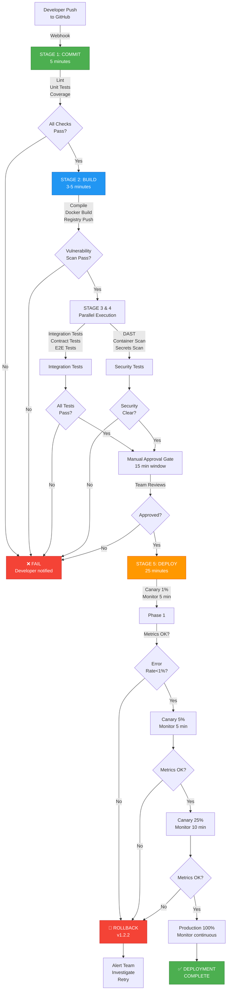

---

## 2. Microservices Deployment Architecture

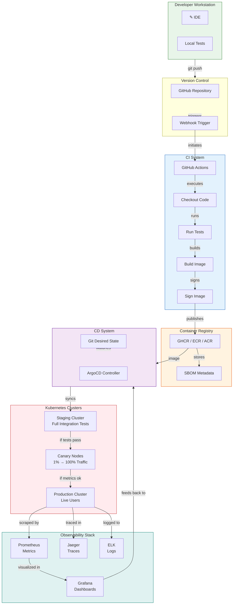

---

## 3. Core CI/CD Principles Interdependencies

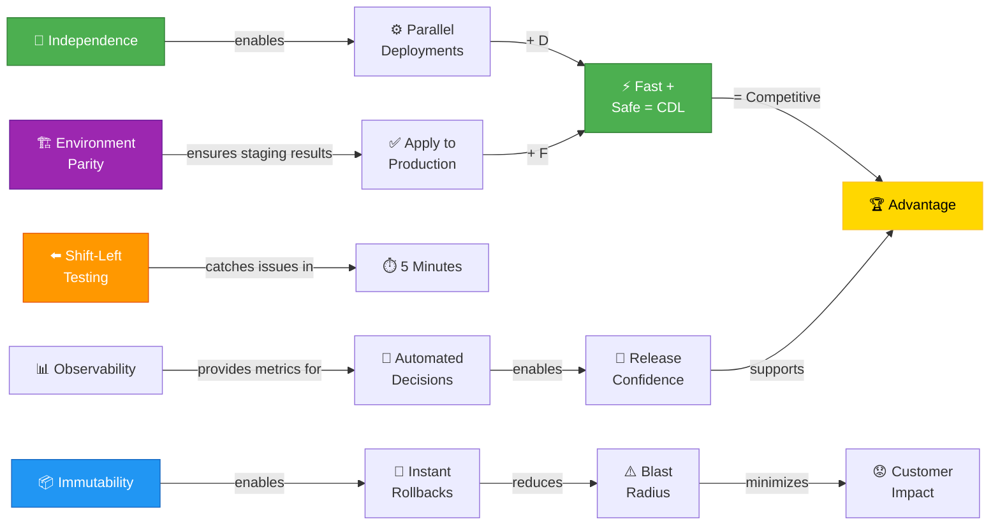

---

## 4. Modern DevOps Stack Integration

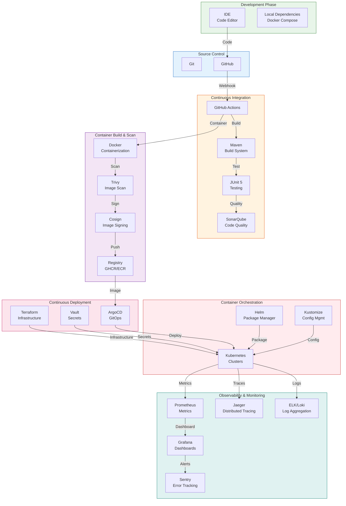

---

## 5. Canary Deployment Metrics Decision Tree

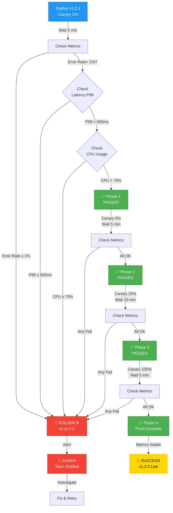

---

## 6. Image Promotion Pipeline with Gates

```mermaid
graph LR
    A["Commit<br/>abc123f"] -->|Build| B["Image Created<br/>sha256:xyz789"]
    
    B -->|Push| C["Container<br/>Registry"]
    
    C -->|GATE 1:<br/>Scan| D{No Critical<br/>CVEs?}
    D -->|No| E["❌ Stop<br/>Promote"]
    D -->|Yes| F["✅ Scan<br/>Passed"]
    
    F -->|Deploy| G["Staging<br/>Environment"]
    
    G -->|GATE 2:<br/>Tests| H{Integration<br/>Tests Pass?}
    H -->|No| E
    H -->|Yes| I["✅ Tests<br/>Passed"]
    
    I -->|GATE 3:<br/>Metrics| J{Error<br/>Rate <1%?}
    J -->|No| E
    J -->|Yes| K["✅ Metrics<br/>OK"]
    
    K -->|GATE 4:<br/>Security| L{SAST/DAST<br/>Clear?}
    L -->|No| E
    L -->|Yes| M["✅ Security<br/>Cleared"]
    
    M -->|GATE 5:<br/>Approval| N{Team<br/>Approved?}
    N -->|No| E
    N -->|Yes| O["Production<br/>Ready"]
    
    O -->|Canary<br/>Promotion| P["Prod: 1%→5%→25%→100%"]
    
    P -->|Continuous<br/>Monitoring| Q["✅ Live in<br/>Production"]
    
    style A fill:#E3F2FD,stroke:#1565C0
    style B fill:#FFF3E0,stroke:#E65100
    style C fill:#F3E5F5,stroke:#6A1B9A
    style F fill:#4CAF50,stroke:#2E7D32,color:#fff
    style I fill:#4CAF50,stroke:#2E7D32,color:#fff
    style K fill:#4CAF50,stroke:#2E7D32,color:#fff
    style M fill:#4CAF50,stroke:#2E7D32,color:#fff
    style O fill:#4CAF50,stroke:#2E7D32,color:#fff
    style P fill:#FF9800,stroke:#E65100,color:#fff
    style Q fill:#4CAF50,stroke:#2E7D32,color:#fff
    style E fill:#F44336,stroke:#C62828,color:#fff
```

---

## 7. Microservices Dependency Graph

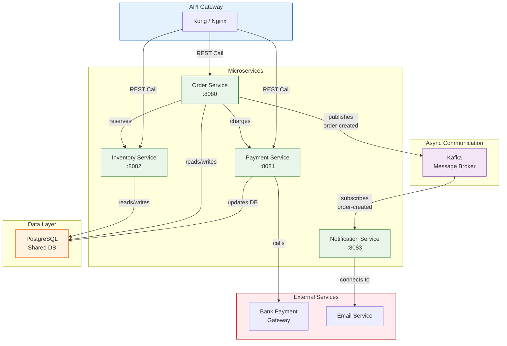

---

## 8. Three Pillars of Observability

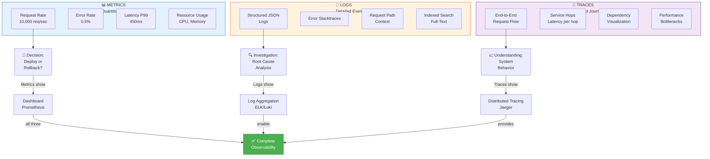

---

## 9. Deployment Strategies Comparison

```mermaid
graph TB
    BG["Blue-Green Deployment<br/>━━━━━━━━━━"]
    BG -->|Infrastructure| BG1["2x cost<br/>Two complete envs"]
    BG -->|Deployment Time| BG2["2 minutes<br/>Instant switch"]
    BG -->|Rollback Time| BG3["2 seconds<br/>Route switch"]
    BG -->|Risk| BG4["Low<br/>Full test before switch"]
    BG -->|Best For| BG5["Monoliths<br/>Stateless services"]
    
    CAN["Canary Deployment<br/>━━━━━━━━━━"]
    CAN -->|Infrastructure| CAN1["1x cost<br/>Reuse existing"]
    CAN -->|Deployment Time| CAN2["25 minutes<br/>Gradual shift"]
    CAN -->|Rollback Time| CAN3["2 minutes<br/>Revert image"]
    CAN -->|Risk| CAN4["Very Low<br/>Real user validation"]
    CAN -->|Best For| CAN5["Microservices<br/>High traffic"]
    
    FF["Feature Flags<br/>━━━━━━━━━━"]
    FF -->|Infrastructure| FF1["1x cost<br/>Same deployed code"]
    FF -->|Deployment Time| FF2["0 minutes<br/>No deploy needed"]
    FF -->|Rollback Time| FF3["Instant<br/>Disable flag"]
    FF -->|Risk| FF4["Medium<br/>Flag logic complexity"]
    FF -->|Best For| FF5["A/B Testing<br/>Gradual rollout"]
    
    RU["Rolling Update<br/>━━━━━━━━━━"]
    RU -->|Infrastructure| RU1["1.2x cost<br/>Extra pods"]
    RU -->|Deployment Time| RU2["10 minutes<br/>Sequential pods"]
    RU -->|Rollback Time| RU3["10 minutes<br/>Re-deploy old"]
    RU -->|Risk| RU4["Medium<br/>Mixed versions"]
    RU -->|Best For| RU5["Batch Jobs<br/>Non-critical"]
    
    style BG fill:#E3F2FD,stroke:#1565C0
    style CAN fill:#E8F5E9,stroke:#2E7D32
    style FF fill:#FFF3E0,stroke:#E65100
    style RU fill:#F3E5F5,stroke:#6A1B9A
    style BG1 fill:#E3F2FD,stroke:#1565C0
    style CAN1 fill:#E8F5E9,stroke:#2E7D32
    style FF1 fill:#FFF3E0,stroke:#E65100
    style RU1 fill:#F3E5F5,stroke:#6A1B9A
```

---

## 10. SLI / SLO / Error Budget Model

```mermaid
graph LR
    A["Target:<br/>99.9%<br/>Availability"] -->|= SLO| B["Service Level<br/>Objective"]
    
    B -->|Measured by| C["Success Rate<br/>Good Requests/<br/>Total Requests"]
    
    C -->|= SLI| D["Service Level<br/>Indicator"]
    
    D -->|Current: 99.95%| E{SLI ><br/>SLO?}
    
    E -->|Yes<br/>99.95% > 99.9%| F["✅ Within Budget<br/>Remaining: 0.05%"]
    E -->|No<br/>99.5% < 99.9%| G["❌ Budget Exceeded<br/>Remaining: -0.4%"]
    
    F -->|Monthly<br/>0.05% × 2.6M sec| H["Budget Remaining:<br/>~44 minutes"]
    G -->|Monthly| I["Exceeded By:<br/>~10 hours"]
    
    H -->|Allows| J["Deploy new version<br/>Observe impact"]
    J -->|If metrics stay| K["Deployment<br/>Approved"]
    J -->|If metrics fail| L["Automatic<br/>Rollback"]
    
    I -->|Requires| M["Focus on<br/>Stability<br/>No new deploys"]
    
    style A fill:#2196F3,stroke:#1565C0,color:#fff
    style B fill:#2196F3,stroke:#1565C0,color:#fff
    style D fill:#FF9800,stroke:#E65100,color:#fff
    style F fill:#4CAF50,stroke:#2E7D32,color:#fff
    style G fill:#F44336,stroke:#C62828,color:#fff
    style H fill:#4CAF50,stroke:#2E7D32,color:#fff
    style K fill:#4CAF50,stroke:#2E7D32,color:#fff
    style L fill:#F44336,stroke:#C62828,color:#fff
```

---

## 11. Circuit Breaker State Machine

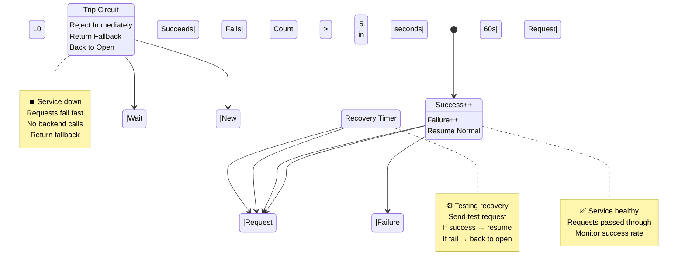

---

## 12. Git Workflow for Microservices

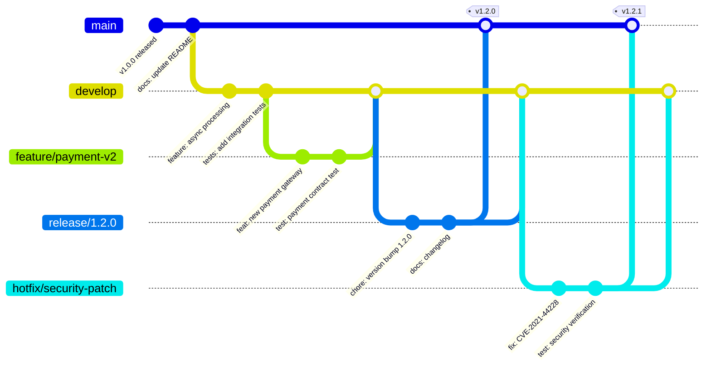

---

## 13. Contract Testing Flow (Pact)

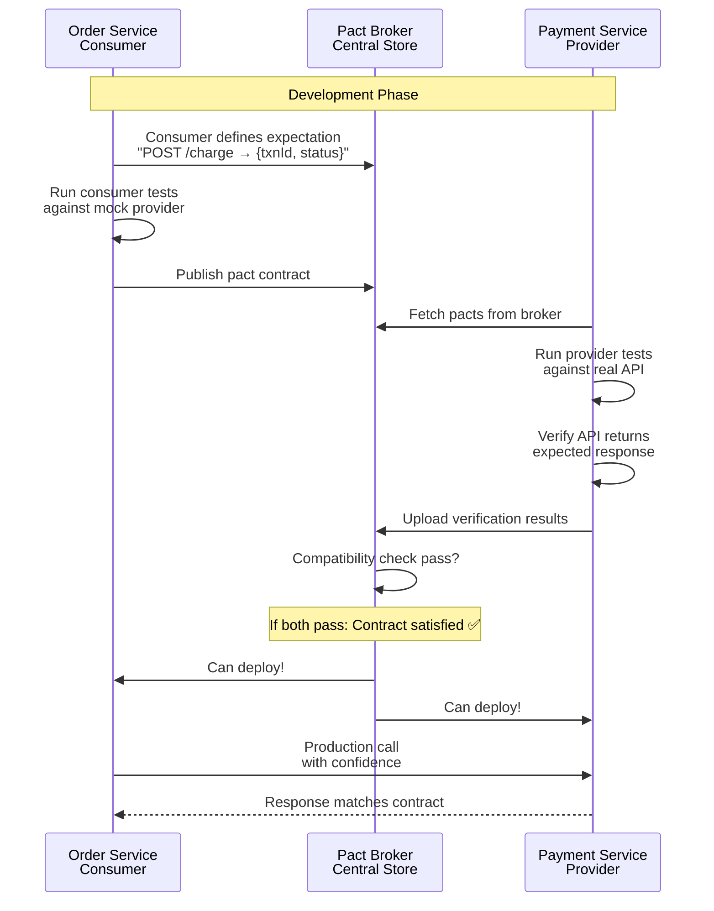

---

## 14. Environment Parity Matrix

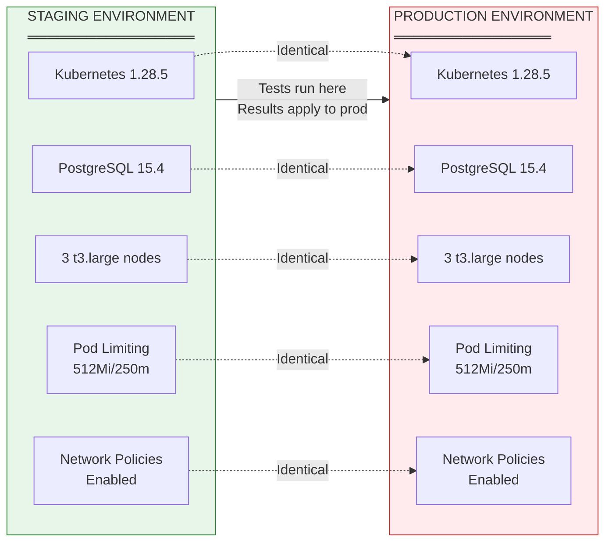

---

## 15. Observability to Deployment Decision Flow

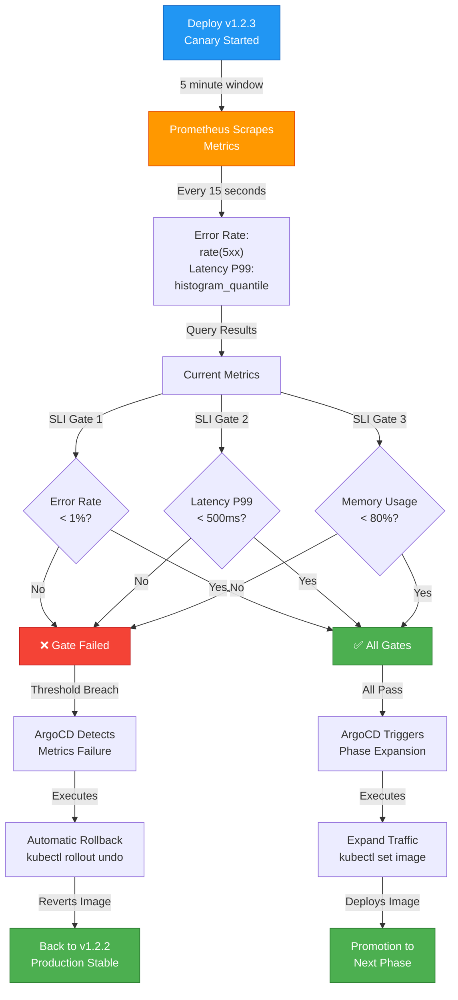

---

## 16. Database Migration - Expand Contract Pattern

```mermaid
graph LR
    subgraph Phase1["Phase 1: EXPAND<br/>Add New Column"]
        A["Database<br/>ALTER TABLE orders<br/>ADD COLUMN buyer_id"]
        B["Code writes to<br/>BOTH columns<br/>customer_id & buyer_id"]
        C["Backward compatible<br/>Old code still works"]
    end
    
    subgraph Phase2["Phase 2: MIGRATE<br/>Populate Data"]
        D["Data Migration<br/>UPDATE orders<br/>SET buyer_id = customer_id"]
        E["Verify all rows<br/>populated"]
    end
    
    subgraph Phase3["Phase 3: CONTRACT<br/>Switch to New"]
        F["Code uses<br/>buyer_id ONLY"]
        G["Deploy new version<br/>reads new column"]
    end
    
    subgraph Phase4["Phase 4: CLEAN<br/>Remove Old"]
        H["Drop old column<br/>DROP COLUMN customer_id"]
        I["All code migrated"]
    end
    
    A -->|Maintains compatibility| B
    B -->|enables| D
    D -->|after verification| E
    E -->|switches code to| F
    F -->|deploys together| G
    G -->|after stability check| H
    H -->|final cleanup| I
    
    style Phase1 fill:#E3F2FD,stroke:#1565C0
    style Phase2 fill:#FFF3E0,stroke:#E65100
    style Phase3 fill:#E8F5E9,stroke:#2E7D32
    style Phase4 fill:#FFEBEE,stroke:#C62828
```

---

## 17. Shift-Left Security - Cost vs Stage

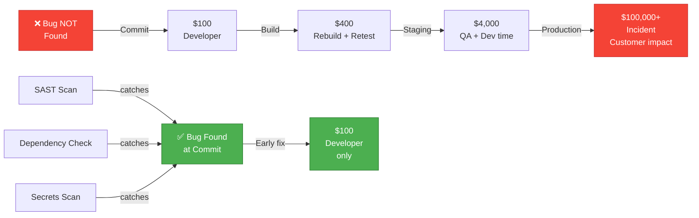

---

## 18. ArgoCD GitOps Reconciliation Loop

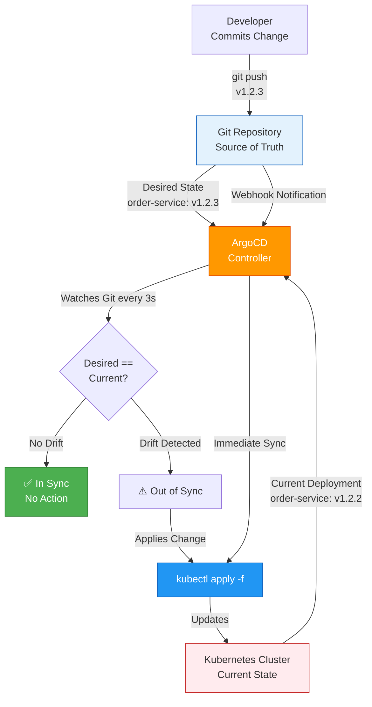

---

## 19. Spring Boot Micrometer Metrics Collection

```mermaid
graph LR
    A["Spring Boot<br/>Application"] -->|@Timed<br/>@Counted| B["JVM Instrumentation"]
    
    B -->|Collects| C["Metrics:<br/>• Request Rate<br/>• Response Time<br/>• Exceptions<br/>• Memory/GC<br/>• Custom Metrics"]
    
    C -->|Exposed at| D["/actuator/prometheus"]
    
    D -->|Prometheus<br/>Scrapes every 15s| E["Prometheus<br/>Time-Series DB"]
    
    E -->|Queries via<br/>PromQL| F["Grafana<br/>Dashboards"]
    
    F -->|Visualizes| G["Dashboards:<br/>Request Rate<br/>Error Rate<br/>Latency<br/>Resource Usage"]
    
    G -->|Alerts based on| H["Alertmanager"]
    
    H -->|Notifies| I["PagerDuty<br/>Slack<br/>Email"]
    
    E -->|Also feeds| J["ArgoCD<br/>Canary Decisions"]
    
    J -->|SLI Gates| K["Promote to<br/>Next Phase<br/>or<br/>Rollback"]
    
    style A fill:#4CAF50,stroke:#2E7D32,color:#fff
    style C fill:#2196F3,stroke:#1565C0,color:#fff
    style E fill:#FF9800,stroke:#E65100,color:#fff
    style F fill:#9C27B0,stroke:#6A1B9A,color:#fff
    style K fill:#E3F2FD,stroke:#1565C0
```

---

## 20. Horizontal Pod Autoscaling with Metrics

```mermaid
graph TD
    A["Deployment:<br/>order-service<br/>Current: 10 pods"] -->|Continuously measures| B["CPU Usage<br/>Target: 70%"]
    
    C["Prometheus Metrics<br/>container_cpu_usage"] -->|Feeds| B
    
    B -->|Current: 85%| D{CPU Usage<br/>Target?}
    
    D -->|< 70% (under-scaled)| E["Scale Down to 8 pods"]
    D -->|> 80% (over-scaled)| F["Scale Up to 15 pods"]
    D -->|70-80% (balanced)| G["Keep at 10 pods"]
    
    E -->|After stability| E1["Monitor metrics<br/>1-5 min"]
    F -->|After stability| F1["Monitor metrics<br/>1-5 min"]
    G -->|Continuous| G1["Maintain current"]
    
    E1 -->|If stable| H["HPA Complete"]
    F1 -->|If stable| H
    G1 -->|No change needed| H
    
    style A fill:#E8F5E9,stroke:#2E7D32
    style B fill:#FF9800,stroke:#E65100,color:#fff
    style E fill:#2196F3,stroke:#1565C0,color:#fff
    style F fill:#F44336,stroke:#C62828,color:#fff
    style G fill:#4CAF50,stroke:#2E7D32,color:#fff
    style H fill:#4CAF50,stroke:#2E7D32,color:#fff
```

---

End of Mermaid Diagrams
