# AWS High Availability - Mermaid Diagrams Reference

Complete visual reference for AWS HA architecture patterns, failover mechanisms, monitoring, and operational flows.

---

## Table of Contents

1. [Architecture & Design](#architecture--design)
2. [Reliability Patterns](#reliability-patterns)
3. [Database & Storage](#database--storage)
4. [Observability & Operations](#observability--operations)
5. [Operational Flows](#operational-flows)

---

## Architecture & Design

### 1. Multi-AZ Failover Timeline

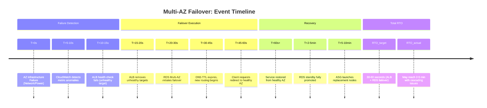
```mermaid
timeline
    title Multi-AZ Failover: Event Timeline
    
    section Failure Detection
    T+0s: AZ Infrastructure Failure (Network/Power)
    T+5-10s: CloudWatch detects metric anomalies
    T+10-15s: ALB health check fails (unhealthy target)
    
    section Failover Execution
    T+15-20s: ALB removes unhealthy targets
    T+20-30s: RDS Multi-AZ initiates failover
    T+30-45s: DNS TTL expires, new routing begins
    T+45-60s: Client requests redirect to healthy AZ
    
    section Recovery
    T+60s+: Service restored from healthy AZ
    T+2-5min: RDS standby fully promoted
    T+5-10min: ASG launches replacement nodes
    
    section Total RTO
    RTO_target: 30-60 seconds (ALB + RDS failover)
    RTO_actual: May reach 2-5 min with cascading issues
```

**Purpose**: Visualizes the time sequence of events during an AZ failure, showing that total failover typically takes 30-120 seconds with proper configuration.

---

### 2. HA Architecture Decision Tree

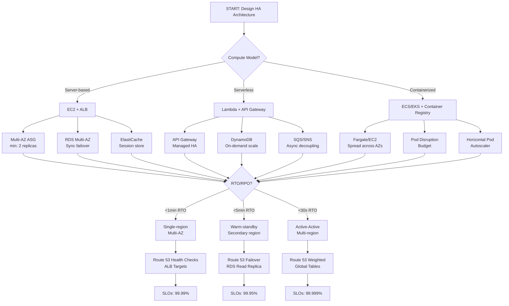
```mermaid
graph TD
    A["START: Design HA Architecture"] --> B{"Compute Model?"}
    
    B -->|Server-based| C["EC2 + ALB"]
    B -->|Serverless| D["Lambda + API Gateway"]
    B -->|Containerized| E["ECS/EKS + Container Registry"]
    
    C --> C1["Multi-AZ ASG<br/>min: 2 replicas"]
    C --> C2["RDS Multi-AZ<br/>Sync failover"]
    C --> C3["ElastiCache<br/>Session store"]
    
    D --> D1["API Gateway<br/>Managed HA"]
    D --> D2["DynamoDB<br/>On-demand scale"]
    D --> D3["SQS/SNS<br/>Async decoupling"]
    
    E --> E1["Fargate/EC2<br/>Spread across AZs"]
    E --> E2["Pod Disruption<br/>Budget"]
    E --> E3["Horizontal Pod<br/>Autoscaler"]
    
    C1 --> F{"RTO/RPO?"}
    C2 --> F
    C3 --> F
    D1 --> F
    D2 --> F
    D3 --> F
    E1 --> F
    E2 --> F
    E3 --> F
    
    F -->|<1min RTO| G["Single-region<br/>Multi-AZ"]
    F -->|<5min RTO| H["Warm-standby<br/>Secondary region"]
    F -->|<30s RTO| I["Active-Active<br/>Multi-region"]
    
    G --> J["Route 53 Health Checks<br/>ALB Targets"]
    H --> K["Route 53 Failover<br/>RDS Read Replica"]
    I --> L["Route 53 Weighted<br/>Global Tables"]
    
    J --> M["SLOs: 99.99%"]
    K --> N["SLOs: 99.95%"]
    L --> O["SLOs: 99.999%"]
```

**Purpose**: Decision tree guiding engineers through compute model selection, RTO/RPO requirements, and corresponding HA strategy.

---

### 3. Multi-AZ Server-Based Architecture

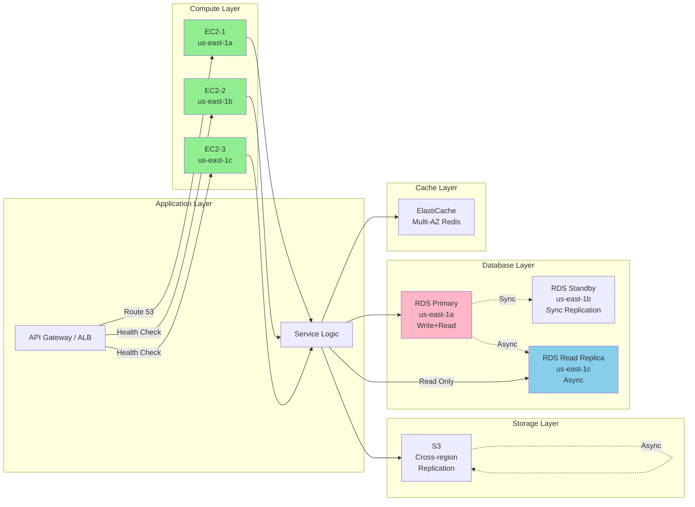
```mermaid
graph LR
    subgraph "Application Layer"
        API["API Gateway / ALB"]
        SVC["Service Logic"]
    end
    
    subgraph "Compute Layer"
        EC2A["EC2-1<br/>us-east-1a"]
        EC2B["EC2-2<br/>us-east-1b"]
        EC2C["EC2-3<br/>us-east-1c"]
    end
    
    subgraph "Cache Layer"
        REDIS["ElastiCache<br/>Multi-AZ Redis"]
    end
    
    subgraph "Database Layer"
        RDSW["RDS Primary<br/>us-east-1a<br/>Write+Read"]
        RDSS["RDS Standby<br/>us-east-1b<br/>Sync Replication"]
        RDSR["RDS Read Replica<br/>us-east-1c<br/>Async"]
    end
    
    subgraph "Storage Layer"
        S3["S3<br/>Cross-region<br/>Replication"]
    end
    
    API -->|Route 53| EC2A
    API -->|Health Check| EC2B
    API -->|Health Check| EC2C
    
    EC2A --> SVC
    EC2B --> SVC
    EC2C --> SVC
    
    SVC --> REDIS
    SVC --> RDSW
    SVC -->|Read Only| RDSR
    SVC --> S3
    
    RDSW -.->|Sync| RDSS
    RDSW -.->|Async| RDSR
    S3 -.->|Async| S3
    
    style EC2A fill:#90EE90
    style EC2B fill:#90EE90
    style EC2C fill:#90EE90
    style RDSW fill:#FFB6C6
    style RDSS fill:#FFEVAD
    style RDSR fill:#87CEEB
```

**Purpose**: Shows complete multi-AZ architecture for server-based applications with compute, cache, database, and storage layers.

---

### 4. Serverless HA Architecture

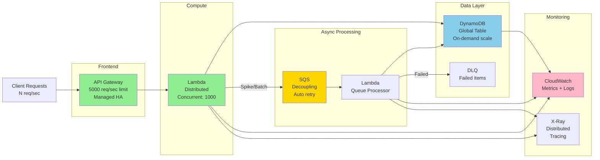
```mermaid
graph LR
    Client["Client Requests<br/>N req/sec"]
    
    subgraph "Frontend"
        APIGW["API Gateway<br/>5000 req/sec limit<br/>Managed HA"]
    end
    
    subgraph "Compute"
        LAMBDA["Lambda<br/>Distributed<br/>Concurrent: 1000"]
    end
    
    subgraph "Async Processing"
        SQS["SQS<br/>Decoupling<br/>Auto retry"]
        WORKER["Lambda<br/>Queue Processor"]
    end
    
    subgraph "Data Layer"
        DYNO["DynamoDB<br/>Global Table<br/>On-demand scale"]
        DLQ["DLQ<br/>Failed items"]
    end
    
    subgraph "Monitoring"
        CW["CloudWatch<br/>Metrics + Logs"]
        XRAY["X-Ray<br/>Distributed<br/>Tracing"]
    end
    
    Client --> APIGW
    APIGW --> LAMBDA
    LAMBDA --> DYNO
    LAMBDA -->|Spike/Batch| SQS
    SQS --> WORKER
    WORKER --> DYNO
    WORKER -->|Failed| DLQ
    
    LAMBDA --> CW
    WORKER --> CW
    LAMBDA --> XRAY
    WORKER --> XRAY
    DYNO --> CW
    
    style APIGW fill:#90EE90
    style LAMBDA fill:#90EE90
    style DYNO fill:#87CEEB
    style SQS fill:#FFD700
    style CW fill:#FFB6C6
```

**Purpose**: Demonstrates serverless HA with Lambda, DynamoDB, and SQS for spike handling and async processing.

---

### 5. Kubernetes Pod Distribution & Orchestration

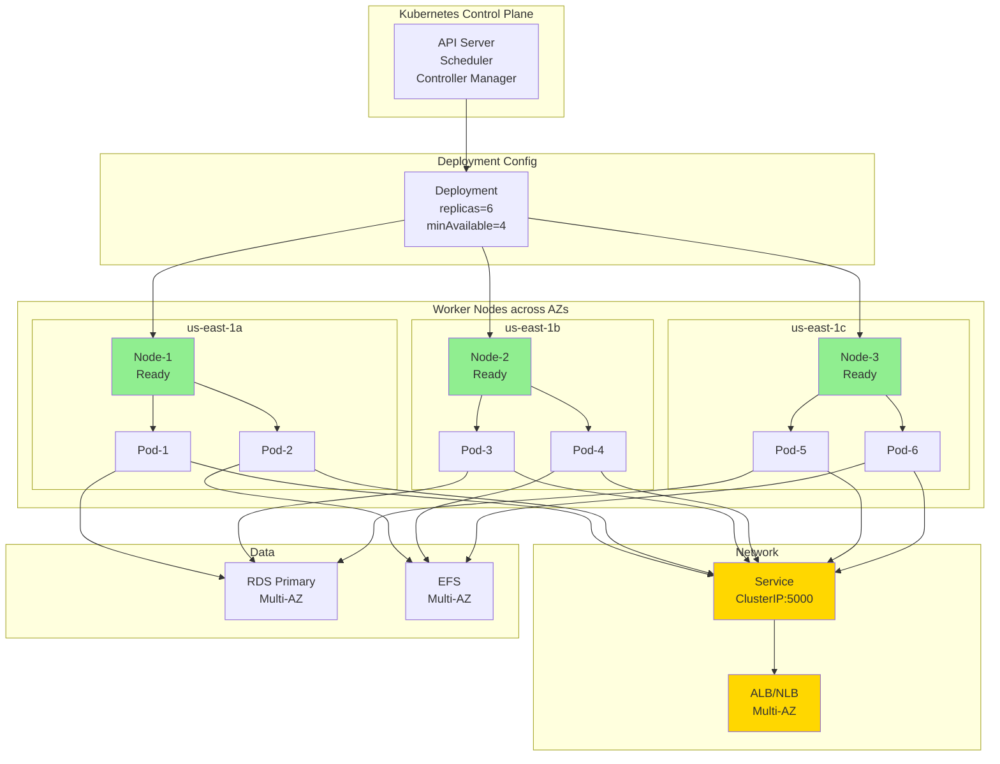
```mermaid
graph TB
    subgraph "Kubernetes Control Plane"
        MASTER["API Server<br/>Scheduler<br/>Controller Manager"]
    end
    
    subgraph "Worker Nodes across AZs"
        subgraph "us-east-1a"
            N1["Node-1<br/>Ready"]
            P1["Pod-1"]
            P2["Pod-2"]
        end
        
        subgraph "us-east-1b"
            N2["Node-2<br/>Ready"]
            P3["Pod-3"]
            P4["Pod-4"]
        end
        
        subgraph "us-east-1c"
            N3["Node-3<br/>Ready"]
            P5["Pod-5"]
            P6["Pod-6"]
        end
    end
    
    subgraph "Deployment Config"
        DEPLOY["Deployment<br/>replicas=6<br/>minAvailable=4"]
    end
    
    subgraph "Network"
        SVC["Service<br/>ClusterIP:5000"]
        LB["ALB/NLB<br/>Multi-AZ"]
    end
    
    subgraph "Data"
        DB["RDS Primary<br/>Multi-AZ"]
        PVC["EFS<br/>Multi-AZ"]
    end
    
    MASTER --> DEPLOY
    DEPLOY --> N1
    DEPLOY --> N2
    DEPLOY --> N3
    
    N1 --> P1
    N1 --> P2
    N2 --> P3
    N2 --> P4
    N3 --> P5
    N3 --> P6
    
    P1 --> SVC
    P2 --> SVC
    P3 --> SVC
    P4 --> SVC
    P5 --> SVC
    P6 --> SVC
    
    SVC --> LB
    
    P1 --> DB
    P3 --> DB
    P5 --> DB
    
    P2 --> PVC
    P4 --> PVC
    P6 --> PVC
    
    style N1 fill:#90EE90
    style N2 fill:#90EE90
    style N3 fill:#90EE90
    style SVC fill:#FFD700
    style LB fill:#FFD700
```

**Purpose**: Shows Kubernetes cluster with pods spread across 3 AZs with pod disruption budgets and service discovery.

---

### 6. AWS Region & Availability Zone Topology

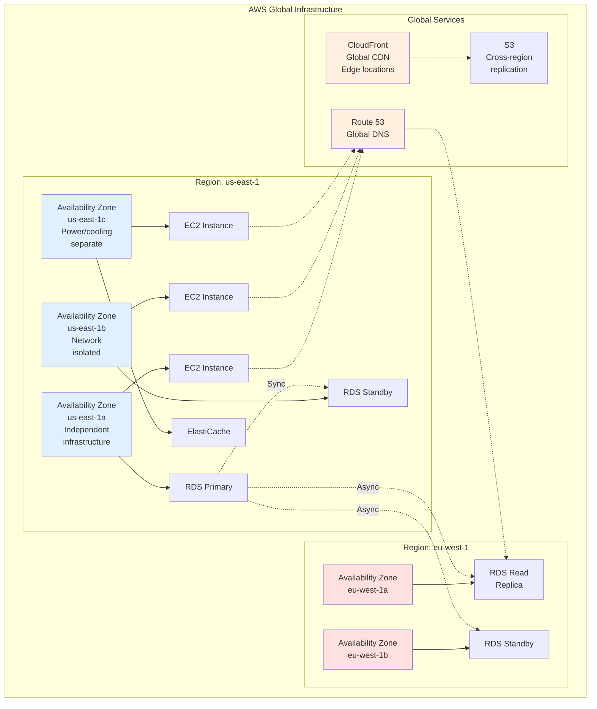
```mermaid
graph TB
    subgraph "AWS Global Infrastructure"
        
        subgraph "Region: us-east-1"
            AZ1["Availability Zone<br/>us-east-1a<br/>Independent<br/>infrastructure"]
            AZ2["Availability Zone<br/>us-east-1b<br/>Network<br/>isolated"]
            AZ3["Availability Zone<br/>us-east-1c<br/>Power/cooling<br/>separate"]
            
            AZ1 --> EC2_1["EC2 Instance"]
            AZ1 --> RDS1["RDS Primary"]
            AZ2 --> EC2_2["EC2 Instance"]
            AZ2 --> RDS2["RDS Standby"]
            AZ3 --> EC2_3["EC2 Instance"]
            AZ3 --> CACHE["ElastiCache"]
        end
        
        subgraph "Region: eu-west-1"
            EAZA["Availability Zone<br/>eu-west-1a"]
            EAZB["Availability Zone<br/>eu-west-1b"]
            
            EAZA --> REPLICA["RDS Read<br/>Replica"]
            EAZB --> STANDBY2["RDS Standby"]
        end
        
        subgraph "Global Services"
            R53["Route 53<br/>Global DNS"]
            CF["CloudFront<br/>Global CDN<br/>Edge locations"]
            S3["S3<br/>Cross-region<br/>replication"]
        end
    end
    
    EC2_1 -.-> R53
    EC2_2 -.-> R53
    EC2_3 -.-> R53
    
    RDS1 -.->|Sync| RDS2
    RDS1 -.->|Async| REPLICA
    RDS1 -.->|Async| STANDBY2
    
    R53 -.-> REPLICA
    CF -.-> S3
    
    style AZ1 fill:#E0F0FF
    style AZ2 fill:#E0F0FF
    style AZ3 fill:#E0F0FF
    style EAZA fill:#FFE0E0
    style EAZB fill:#FFE0E0
    style R53 fill:#FFF0E0
    style CF fill:#FFF0E0
```

**Purpose**: Visualizes AWS global infrastructure with multi-region, multi-AZ topology and replication patterns.

---

## Reliability Patterns

### 7. Circuit Breaker State Machine

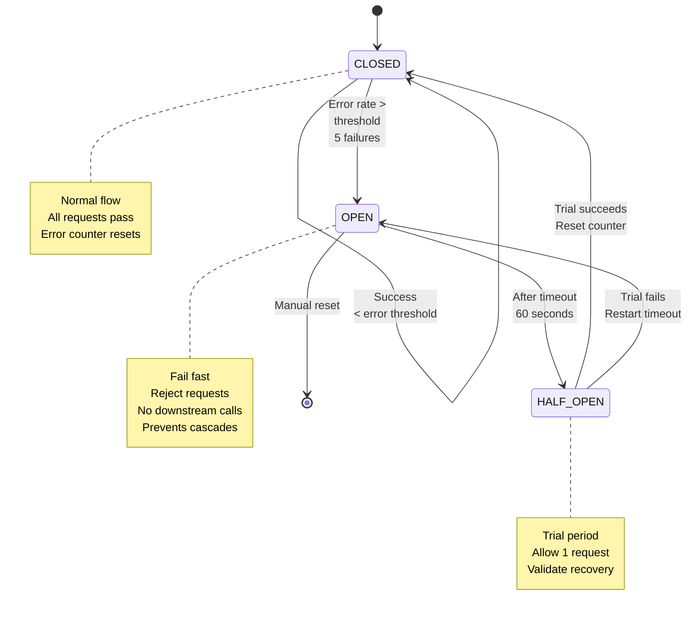
```mermaid
stateDiagram-v2
    [*] --> CLOSED
    
    CLOSED --> OPEN: Error rate ><br/>threshold<br/>5 failures
    
    OPEN --> HALF_OPEN: After timeout<br/>60 seconds
    
    CLOSED --> CLOSED: Success<br/>< error threshold
    
    HALF_OPEN --> CLOSED: Trial succeeds<br/>Reset counter
    HALF_OPEN --> OPEN: Trial fails<br/>Restart timeout
    
    OPEN --> [*]: Manual reset
    
    note right of CLOSED
        Normal flow
        All requests pass
        Error counter resets
    end note
    
    note right of OPEN
        Fail fast
        Reject requests
        No downstream calls
        Prevents cascades
    end note
    
    note right of HALF_OPEN
        Trial period
        Allow 1 request
        Validate recovery
    end note
```

**Purpose**: State machine showing circuit breaker transitions to prevent cascading failures.

---

### 8. Cascading Failures: With & Without Circuit Breaker

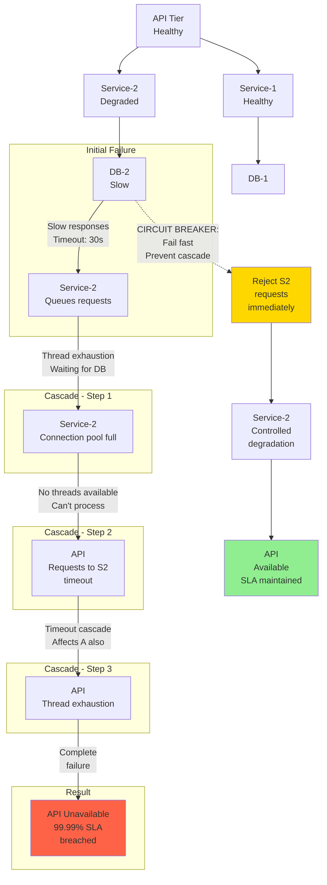
```mermaid
graph TD
    API["API Tier<br/>Healthy"]
    
    API --> SVC1["Service-1<br/>Healthy"]
    API --> SVC2["Service-2<br/>Degraded"]
    
    SVC1 --> DB1["DB-1"]
    SVC2 --> DB2["DB-2<br/>Slow"]
    
    subgraph "Initial Failure"
        DB2 -->|Slow responses<br/>Timeout: 30s| SVC2A["Service-2<br/>Queues requests"]
    end
    
    subgraph "Cascade - Step 1"
        SVC2A -->|Thread exhaustion<br/>Waiting for DB| SVC2B["Service-2<br/>Connection pool full"]
    end
    
    subgraph "Cascade - Step 2"
        SVC2B -->|No threads available<br/>Can't process| API2["API<br/>Requests to S2<br/>timeout"]
    end
    
    subgraph "Cascade - Step 3"
        API2 -->|Timeout cascade<br/>Affects A also| API3["API<br/>Thread exhaustion"]
    end
    
    subgraph "Result"
        API3 -->|Complete<br/>failure| OUTAGE["API Unavailable<br/>99.99% SLA<br/>breached"]
    end
    
    DB2 -.->|CIRCUIT BREAKER:<br/>Fail fast<br/>Prevent cascade| CB["Reject S2<br/>requests<br/>immediately"]
    CB --> SVC2LIMITED["Service-2<br/>Controlled<br/>degradation"]
    SVC2LIMITED --> API_OK["API<br/>Available<br/>SLA maintained"]
    
    style OUTAGE fill:#FF6347
    style API_OK fill:#90EE90
    style CB fill:#FFD700
```

**Purpose**: Compares system behavior without (cascading failure) vs with (controlled degradation) circuit breakers.

---

### 9. RTO/RPO Strategy Comparison

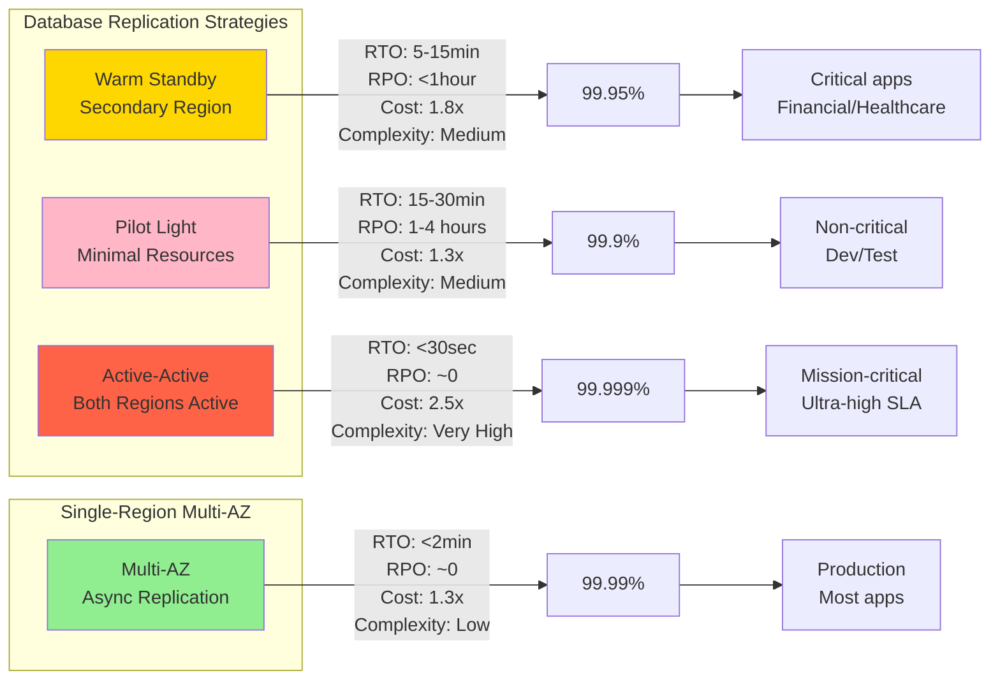
```mermaid
graph LR
    subgraph "Database Replication Strategies"
        WARM["Warm Standby<br/>Secondary Region"]
        PILOT["Pilot Light<br/>Minimal Resources"]
        ACTIVE["Active-Active<br/>Both Regions Active"]
    end
    
    subgraph "Single-Region Multi-AZ"
        MULTIAZ["Multi-AZ<br/>Async Replication"]
    end
    
    MULTIAZ -->|RTO: <2min<br/>RPO: ~0<br/>Cost: 1.3x<br/>Complexity: Low| A["99.99%"]
    WARM -->|RTO: 5-15min<br/>RPO: <1hour<br/>Cost: 1.8x<br/>Complexity: Medium| B["99.95%"]
    PILOT -->|RTO: 15-30min<br/>RPO: 1-4 hours<br/>Cost: 1.3x<br/>Complexity: Medium| C["99.9%"]
    ACTIVE -->|RTO: <30sec<br/>RPO: ~0<br/>Cost: 2.5x<br/>Complexity: Very High| D["99.999%"]
    
    A --> USE1["Production<br/>Most apps"]
    B --> USE2["Critical apps<br/>Financial/Healthcare"]
    C --> USE3["Non-critical<br/>Dev/Test"]
    D --> USE4["Mission-critical<br/>Ultra-high SLA"]
    
    style MULTIAZ fill:#90EE90
    style WARM fill:#FFD700
    style PILOT fill:#FFB6C6
    style ACTIVE fill:#FF6347
```

**Purpose**: Compares recovery strategies with associated RTO, RPO, cost, and complexity metrics.

---

### 10. Availability Tiers & Target Selection

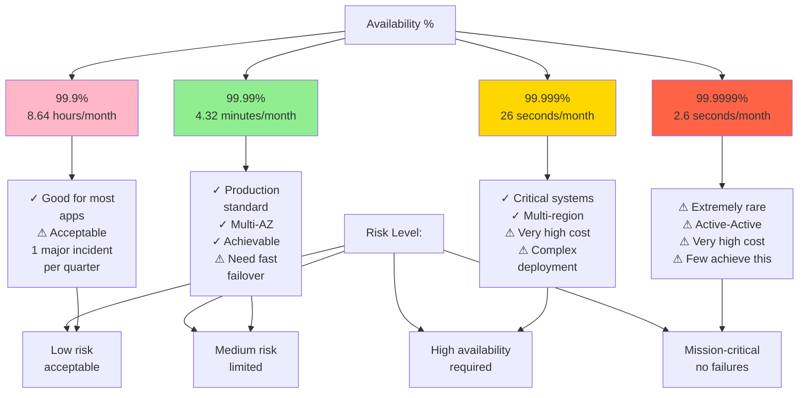
```mermaid
graph TD
    AVAIL["Availability %"]
    
    AVAIL --> A999["99.9%<br/>8.64 hours/month"]
    AVAIL --> A9999["99.99%<br/>4.32 minutes/month"]
    AVAIL --> A99999["99.999%<br/>26 seconds/month"]
    AVAIL --> A999999["99.9999%<br/>2.6 seconds/month"]
    
    A999 --> DESC1["✓ Good for most<br/>apps<br/>⚠ Acceptable<br/>1 major incident<br/>per quarter"]
    
    A9999 --> DESC2["✓ Production<br/>standard<br/>✓ Multi-AZ<br/>✓ Achievable<br/>⚠ Need fast<br/>failover"]
    
    A99999 --> DESC3["✓ Critical systems<br/>✓ Multi-region<br/>⚠ Very high cost<br/>⚠ Complex<br/>deployment"]
    
    A999999 --> DESC4["⚠ Extremely rare<br/>⚠ Active-Active<br/>⚠ Very high cost<br/>⚠ Few achieve this"]
    
    RISK["Risk Level:"]
    RISK --> R1["Low risk<br/>acceptable"]
    RISK --> R2["Medium risk<br/>limited"]
    RISK --> R3["High availability<br/>required"]
    RISK --> R4["Mission-critical<br/>no failures"]
    
    DESC1 --> R1
    DESC2 --> R2
    DESC3 --> R3
    DESC4 --> R4
    
    style A999 fill:#FFB6C6
    style A9999 fill:#90EE90
    style A99999 fill:#FFD700
    style A999999 fill:#FF6347
```

**Purpose**: Shows availability targets with monthly downtime, risk levels, and use cases.

---

## Database & Storage

### 11. RDS Multi-AZ vs Read Replicas vs Cross-Region

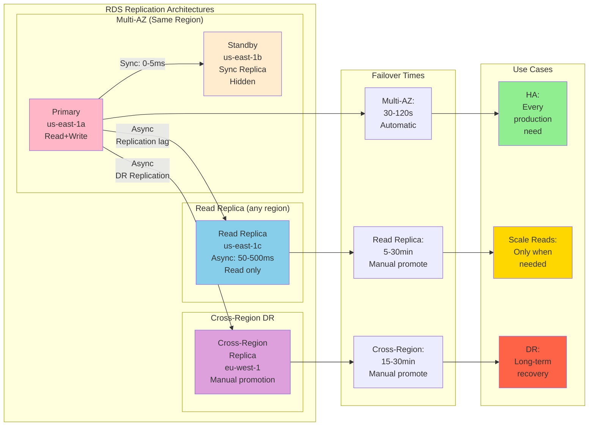
```mermaid
graph LR
    subgraph "RDS Replication Architectures"
        
        subgraph "Multi-AZ (Same Region)"
            PRIMARY["Primary<br/>us-east-1a<br/>Read+Write"]
            STANDBY["Standby<br/>us-east-1b<br/>Sync Replica<br/>Hidden"]
            PRIMARY -->|Sync: 0-5ms| STANDBY
        end
        
        subgraph "Read Replica (any region)"
            REPLICA["Read Replica<br/>us-east-1c<br/>Async: 50-500ms<br/>Read only"]
            PRIMARY -->|Async<br/>Replication lag| REPLICA
        end
        
        subgraph "Cross-Region DR"
            CREPLICA["Cross-Region<br/>Replica<br/>eu-west-1<br/>Manual promotion"]
            PRIMARY -->|Async<br/>DR Replication| CREPLICA
        end
    end
    
    subgraph "Failover Times"
        MZ["Multi-AZ:<br/>30-120s<br/>Automatic"]
        RR["Read Replica:<br/>5-30min<br/>Manual promote"]
        CR["Cross-Region:<br/>15-30min<br/>Manual promote"]
    end
    
    subgraph "Use Cases"
        HA["HA:<br/>Every<br/>production<br/>need"]
        SCALE["Scale Reads:<br/>Only when<br/>needed"]
        DRHA["DR:<br/>Long-term<br/>recovery"]
    end
    
    PRIMARY --> MZ
    REPLICA --> RR
    CREPLICA --> CR
    
    MZ --> HA
    RR --> SCALE
    CR --> DRHA
    
    style PRIMARY fill:#FFB6C6
    style STANDBY fill:#FFEBCD
    style REPLICA fill:#87CEEB
    style CREPLICA fill:#DDA0DD
    style HA fill:#90EE90
    style SCALE fill:#FFD700
    style DRHA fill:#FF6347
```

**Purpose**: Distinguishes Multi-AZ, Read Replicas, and Cross-Region strategies with failover times and use cases.

---

### 12. S3 Cross-Region Replication Strategy

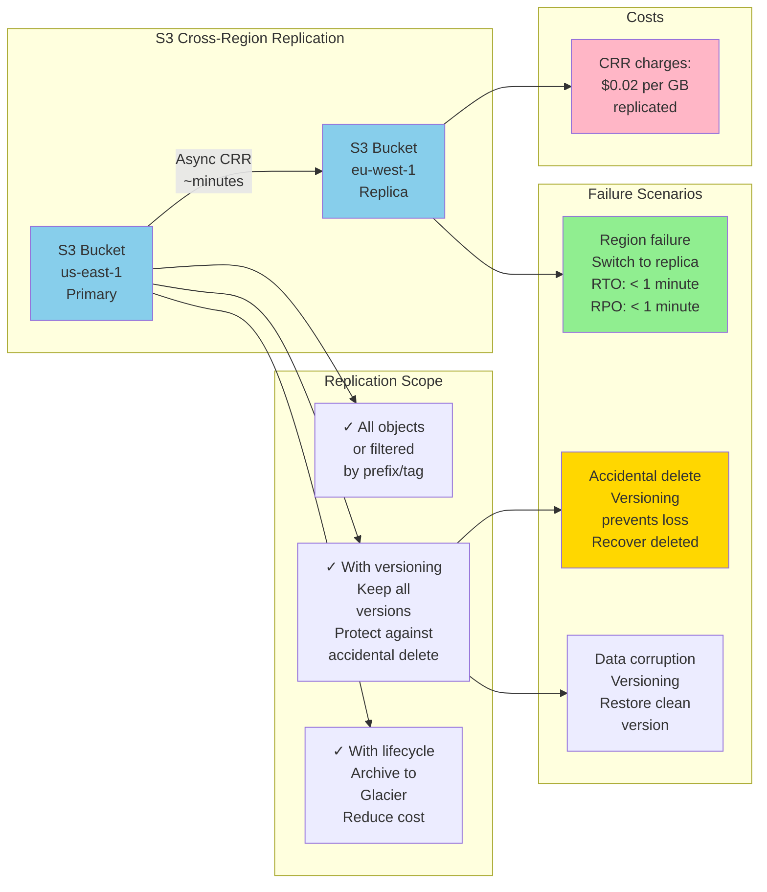
```mermaid
graph LR
    subgraph "S3 Cross-Region Replication"
        S3US["S3 Bucket<br/>us-east-1<br/>Primary"]
        S3EU["S3 Bucket<br/>eu-west-1<br/>Replica"]
        
        S3US -->|Async CRR<br/>~minutes| S3EU
    end
    
    subgraph "Replication Scope"
        ALL["✓ All objects<br/>or filtered<br/>by prefix/tag"]
        VERSIONS["✓ With versioning<br/>Keep all<br/>versions<br/>Protect against<br/>accidental delete"]
        LIFECYCLE["✓ With lifecycle<br/>Archive to<br/>Glacier<br/>Reduce cost"]
    end
    
    subgraph "Failure Scenarios"
        REGIONAL["Region failure<br/>Switch to replica<br/>RTO: < 1 minute<br/>RPO: < 1 minute"]
        DELETE["Accidental delete<br/>Versioning<br/>prevents loss<br/>Recover deleted"]
        CORRUPTION["Data corruption<br/>Versioning<br/>Restore clean<br/>version"]
    end
    
    subgraph "Costs"
        CRR["CRR charges:<br/>$0.02 per GB<br/>replicated"]
    end
    
    S3US --> ALL
    S3US --> VERSIONS
    S3US --> LIFECYCLE
    S3EU --> REGIONAL
    VERSIONS --> DELETE
    VERSIONS --> CORRUPTION
    S3EU --> CRR
    
    style S3US fill:#87CEEB
    style S3EU fill:#87CEEB
    style REGIONAL fill:#90EE90
    style DELETE fill:#FFD700
    style CRR fill:#FFB6C6
```

**Purpose**: Shows S3 CRR strategy with versioning, lifecycle policies, and protection mechanisms.

---

### 13. DynamoDB Global Tables: Multi-Region Active-Active

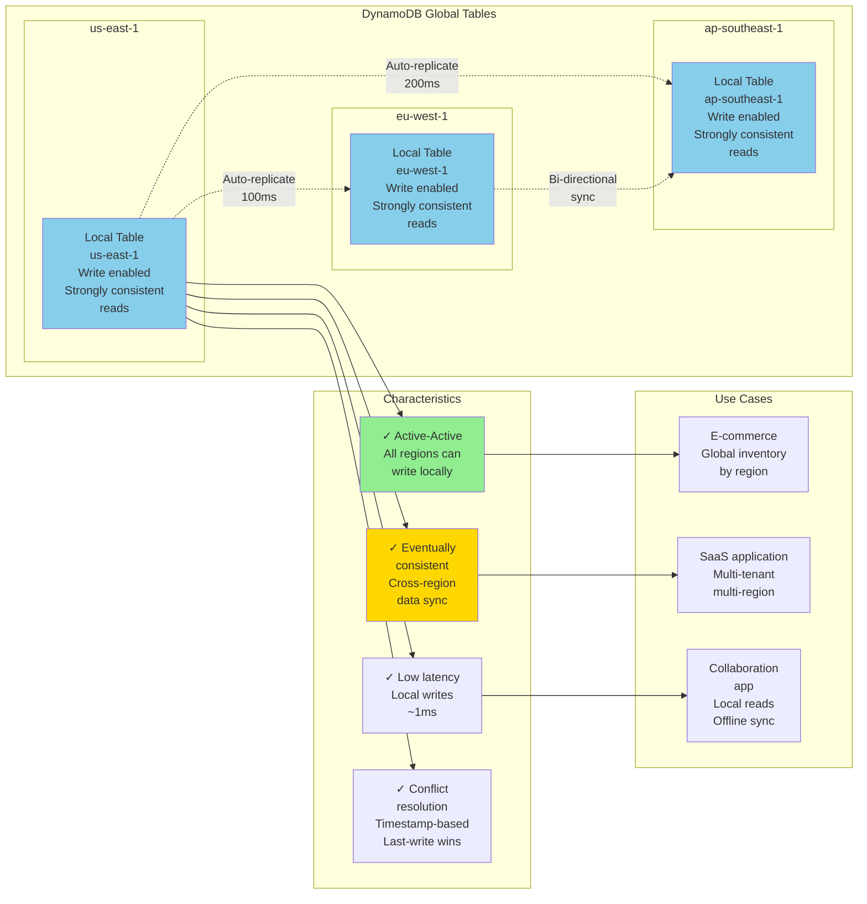
```mermaid
graph LR
    subgraph "DynamoDB Global Tables"
        
        subgraph "us-east-1"
            TABLE1["Local Table<br/>us-east-1<br/>Write enabled<br/>Strongly consistent<br/>reads"]
        end
        
        subgraph "eu-west-1"
            TABLE2["Local Table<br/>eu-west-1<br/>Write enabled<br/>Strongly consistent<br/>reads"]
        end
        
        subgraph "ap-southeast-1"
            TABLE3["Local Table<br/>ap-southeast-1<br/>Write enabled<br/>Strongly consistent<br/>reads"]
        end
        
        TABLE1 -.->|Auto-replicate<br/>100ms| TABLE2
        TABLE1 -.->|Auto-replicate<br/>200ms| TABLE3
        TABLE2 -.->|Bi-directional<br/>sync| TABLE3
    end
    
    subgraph "Characteristics"
        ACTIVEACTIVE["✓ Active-Active<br/>All regions can<br/>write locally"]
        EVENTUAL["✓ Eventually<br/>consistent<br/>Cross-region<br/>data sync"]
        LOWLAT["✓ Low latency<br/>Local writes<br/>~1ms"]
        CONFLICT["✓ Conflict<br/>resolution<br/>Timestamp-based<br/>Last-write wins"]
    end
    
    subgraph "Use Cases"
        ECOMMERCE["E-commerce<br/>Global inventory<br/>by region"]
        SAS["SaaS application<br/>Multi-tenant<br/>multi-region"]
        COLLAB["Collaboration<br/>app<br/>Local reads<br/>Offline sync"]
    end
    
    TABLE1 --> ACTIVEACTIVE
    TABLE1 --> EVENTUAL
    TABLE1 --> LOWLAT
    TABLE1 --> CONFLICT
    
    ACTIVEACTIVE --> ECOMMERCE
    EVENTUAL --> SAS
    LOWLAT --> COLLAB
    
    style TABLE1 fill:#87CEEB
    style TABLE2 fill:#87CEEB
    style TABLE3 fill:#87CEEB
    style ACTIVEACTIVE fill:#90EE90
    style EVENTUAL fill:#FFD700
```

**Purpose**: Demonstrates DynamoDB Global Tables active-active architecture with automatic replication and conflict resolution.

---

## Observability & Operations

### 14. Monitoring & Alerting Stack

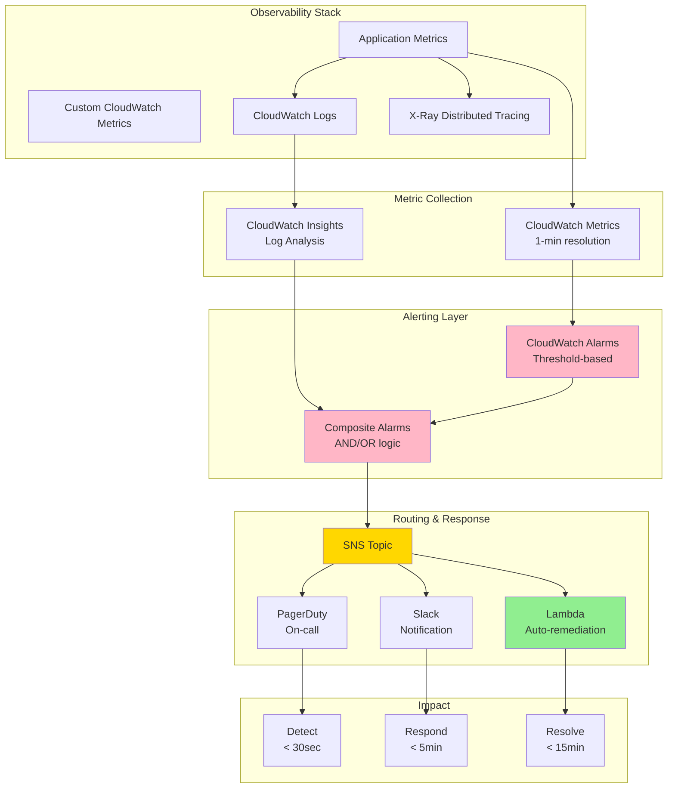
```mermaid
graph TD
    subgraph "Observability Stack"
        APP["Application Metrics"]
        CUSTOM["Custom CloudWatch Metrics"]
        LOGS["CloudWatch Logs"]
        TRACE["X-Ray Distributed Tracing"]
    end
    
    subgraph "Metric Collection"
        CLOUDWATCH["CloudWatch Metrics<br/>1-min resolution"]
        INSIGHTS["CloudWatch Insights<br/>Log Analysis"]
    end
    
    subgraph "Alerting Layer"
        ALARM["CloudWatch Alarms<br/>Threshold-based"]
        COMPOSITE["Composite Alarms<br/>AND/OR logic"]
    end
    
    subgraph "Routing & Response"
        SNS["SNS Topic"]
        PAGERDUTY["PagerDuty<br/>On-call"]
        SLACK["Slack<br/>Notification"]
        LAMBDA["Lambda<br/>Auto-remediation"]
    end
    
    subgraph "Impact"
        DETECT["Detect<br/>< 30sec"]
        RESPOND["Respond<br/>< 5min"]
        RESOLVE["Resolve<br/>< 15min"]
    end
    
    APP --> CLOUDWATCH
    APP --> LOGS
    APP --> TRACE
    
    CLOUDWATCH --> ALARM
    LOGS --> INSIGHTS
    INSIGHTS --> COMPOSITE
    
    ALARM --> COMPOSITE
    COMPOSITE --> SNS
    
    SNS --> PAGERDUTY
    SNS --> SLACK
    SNS --> LAMBDA
    
    PAGERDUTY --> DETECT
    SLACK --> RESPOND
    LAMBDA --> RESOLVE
    
    style ALARM fill:#FFB6C6
    style COMPOSITE fill:#FFB6C6
    style SNS fill:#FFD700
    style LAMBDA fill:#90EE90
```

**Purpose**: Shows complete observability stack from metrics collection through alerting and remediation.

---

### 15. ALB Health Check & Deregistration Process

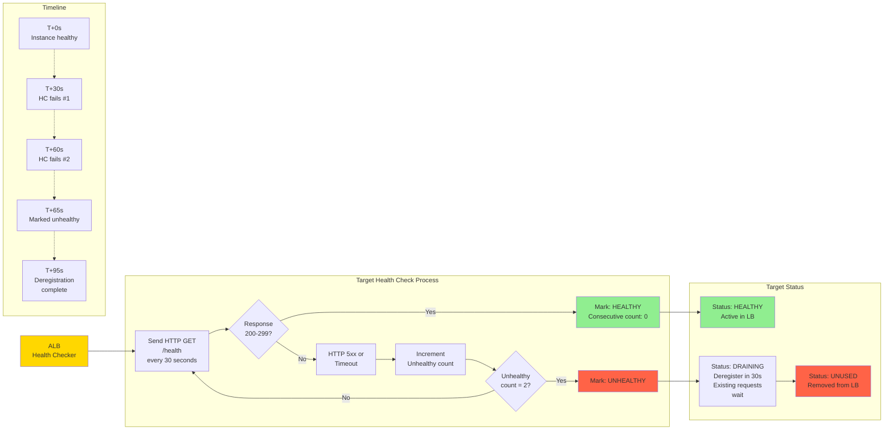
```mermaid
graph LR
    ALB["ALB<br/>Health Checker"]
    
    subgraph "Target Health Check Process"
        HC1["Send HTTP GET<br/>/health<br/>every 30 seconds"]
        HC2{"Response<br/>200-299?"}
        HC3["Mark: HEALTHY<br/>Consecutive count: 0"]
        HC4["HTTP 5xx or<br/>Timeout"]
        HC5["Increment<br/>Unhealthy count"]
        HC6{"Unhealthy<br/>count = 2?"}
        HC7["Mark: UNHEALTHY"]
    end
    
    subgraph "Target Status"
        STATUS1["Status: HEALTHY<br/>Active in LB"]
        STATUS2["Status: DRAINING<br/>Deregister in 30s<br/>Existing requests<br/>wait"]
        STATUS3["Status: UNUSED<br/>Removed from LB"]
    end
    
    subgraph "Timeline"
        T0["T+0s<br/>Instance healthy"]
        T30["T+30s<br/>HC fails #1"]
        T60["T+60s<br/>HC fails #2"]
        T65["T+65s<br/>Marked unhealthy"]
        T95["T+95s<br/>Deregistration<br/>complete"]
    end
    
    ALB --> HC1
    HC1 --> HC2
    HC2 -->|Yes| HC3
    HC3 --> STATUS1
    HC2 -->|No| HC4
    HC4 --> HC5
    HC5 --> HC6
    HC6 -->|Yes| HC7
    HC6 -->|No| HC1
    HC7 --> STATUS2
    STATUS2 --> STATUS3
    
    T0 -.-> T30
    T30 -.-> T60
    T60 -.-> T65
    T65 -.-> T95
    
    style ALB fill:#FFD700
    style HC3 fill:#90EE90
    style HC7 fill:#FF6347
    style STATUS1 fill:#90EE90
    style STATUS3 fill:#FF6347
```

**Purpose**: Details ALB health check intervals, unhealthy thresholds, and target deregistration timeline.

---

### 16. Incident Response Workflow

```mermaid
graph LR
    subgraph "Incident Detection"
        MONITOR["Monitoring<br/>CloudWatch<br/>X-Ray"]
        ALERT["Alert<br/>Threshold<br/>breached"]
        PAGERDUTY["PagerDuty<br/>On-call notified"]
    end
    
    subgraph "Incident Response"
        ACKTIME["Acknowledge<br/>< 5 minutes"]
        RUNBOOK["Execute<br/>Runbook"]
        INVESTIGATE["Investigate<br/>Root cause"]
    end
    
    subgraph "Incident Resolution"
        REMEDIATE["Auto-remediate<br/>or Manual fix"]
        VALIDATE["Validate<br/>Service restored"]
        CLOSETICKET["Close incident"]
    end
    
    subgraph "Post-Mortem"
        POSTMORTEM["Post-Mortem<br/>Meeting"]
        ROOTCAUSE["Document<br/>Root cause"]
        ACTION["Action items<br/>Preventive"]
    end
    
    MONITOR --> ALERT
    ALERT --> PAGERDUTY
    PAGERDUTY --> ACKTIME
    ACKTIME --> RUNBOOK
    RUNBOOK --> INVESTIGATE
    INVESTIGATE --> REMEDIATE
    REMEDIATE --> VALIDATE
    VALIDATE --> CLOSETICKET
    CLOSETICKET --> POSTMORTEM
    POSTMORTEM --> ROOTCAUSE
    ROOTCAUSE --> ACTION
    
    action["Actions fuel<br/>reliability<br/>improvements"]
    ACTION --> action
    
    style MONITOR fill:#87CEEB
    style ALERT fill:#FFB6C6
    style PAGERDUTY fill:#FF6347
    style RUNBOOK fill:#FFD700
    style REMEDIATE fill:#90EE90
    style VALIDATE fill:#90EE90
    style POSTMORTEM fill:#DDA0DD
```

**Purpose**: Shows complete incident response lifecycle from detection through post-mortem.

---

### 17. SLO Error Budget Timeline

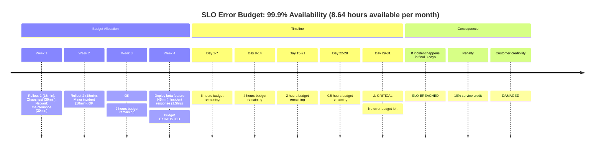
```mermaid
timeline
    title SLO Error Budget: 99.9% Availability (8.64 hours available per month)
    
    section Budget Allocation
    Week 1: Rollout-1 (15min), Chaos test (30min), Network maintenance (20min)
    Week 2: Rollout-2 (18min), Minor incident (10min), OK
    Week 3: OK: 2 hours budget remaining
    Week 4: Deploy beta feature (45min), Incident response (1.5hrs): Budget EXHAUSTED
    
    section Timeline
    Day 1-7: 6 hours budget remaining
    Day 8-14: 4 hours budget remaining
    Day 15-21: 2 hours budget remaining
    Day 22-28: 0.5 hours budget remaining
    Day 29-31: ⚠️ CRITICAL: No error budget left
    
    section Consequence
    If incident happens in final 3 days: SLO BREACHED
    Penalty: 10% service credit
    Customer credibility: DAMAGED
```

**Purpose**: Visualizes error budget consumption throughout a month and consequences of exhaustion.

---

## Operational Flows

### 18. Lambda Cold Start Timeline

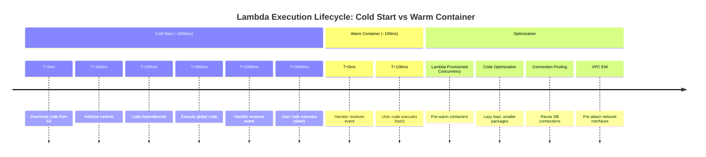
```mermaid
timeline
    title Lambda Execution Lifecycle: Cold Start vs Warm Container
    
    section Cold Start (~3000ms)
    T+0ms: Download code from S3
    T+100ms: Initialize runtime
    T+200ms: Load dependencies
    T+500ms: Execute global code
    T+1000ms: Handler receives event
    T+3000ms: User code executes (slow!)
    
    section Warm Container (~100ms)
    T+0ms: Handler receives event
    T+100ms: User code executes (fast!)
    
    section Optimization
    Lambda Provisioned Concurrency: Pre-warm containers
    Code Optimization: Lazy load, smaller packages
    Connection Pooling: Reuse DB connections
    VPC ENI: Pre-attach network interfaces
```

**Purpose**: Breaks down Lambda cold start phases and optimization strategies for latency reduction.

---

### 19. Auto Scaling Group Decision Flow

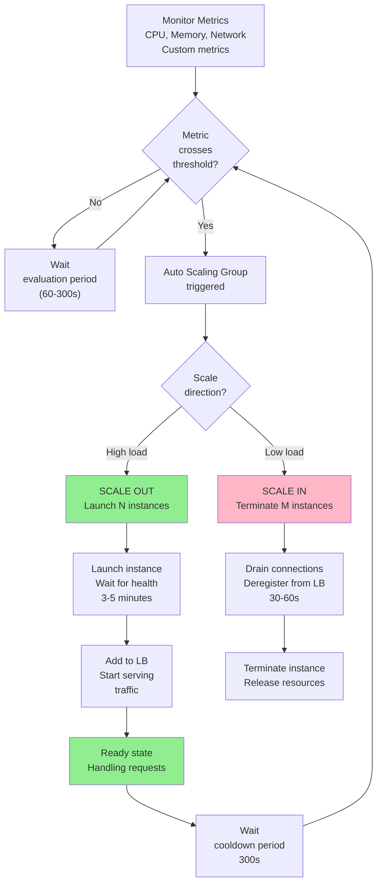
```mermaid
graph TD
    METRIC["Monitor Metrics<br/>CPU, Memory, Network<br/>Custom metrics"]
    
    METRIC --> CHECK{"Metric<br/>crosses<br/>threshold?"}
    
    CHECK -->|No| WAIT["Wait<br/>evaluation period<br/>(60-300s)"]
    WAIT --> CHECK
    
    CHECK -->|Yes| ASG["Auto Scaling Group<br/>triggered"]
    
    ASG --> DECISION{"Scale<br/>direction?"}
    
    DECISION -->|High load| SCALEUP["SCALE OUT<br/>Launch N instances"]
    DECISION -->|Low load| SCALEDOWN["SCALE IN<br/>Terminate M instances"]
    
    SCALEUP --> UP1["Launch instance<br/>Wait for health<br/>3-5 minutes"]
    UP1 --> UP2["Add to LB<br/>Start serving<br/>traffic"]
    UP2 --> READY["Ready state<br/>Handling requests"]
    
    SCALEDOWN --> DOWN1["Drain connections<br/>Deregister from LB<br/>30-60s"]
    DOWN1 --> DOWN2["Terminate instance<br/>Release resources"]
    
    READY --> WAIT2["Wait<br/>cooldown period<br/>300s"]
    WAIT2 --> CHECK
    
    style SCALEUP fill:#90EE90
    style SCALEDOWN fill:#FFB6C6
    style READY fill:#90EE90
```

**Purpose**: Flowchart of auto-scaling decision logic including scale-up/scale-down timelines.

---

### 20. Capacity Planning & Right-Sizing

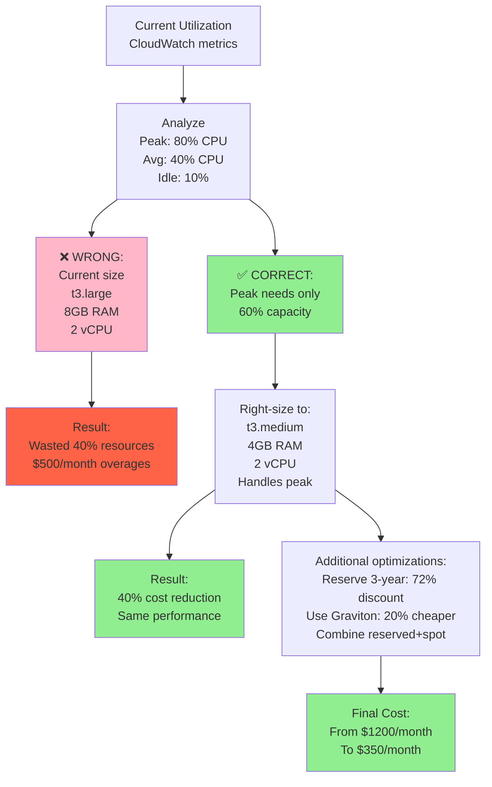
```mermaid
graph TD
    BASELINE["Current Utilization<br/>CloudWatch metrics"]
    
    BASELINE --> ANALYZE["Analyze<br/>Peak: 80% CPU<br/>Avg: 40% CPU<br/>Idle: 10%"]
    
    ANALYZE --> WRONG["❌ WRONG:<br/>Current size<br/>t3.large<br/>8GB RAM<br/>2 vCPU"]
    
    ANALYZE --> RIGHT["✅ CORRECT:<br/>Peak needs only<br/>60% capacity"]
    
    WRONG --> WASTE["Result:<br/>Wasted 40% resources<br/>$500/month overages"]
    
    RIGHT --> RIGHTSIZE["Right-size to:<br/>t3.medium<br/>4GB RAM<br/>2 vCPU<br/>Handles peak"]
    
    RIGHTSIZE --> SAVINGS["Result:<br/>40% cost reduction<br/>Same performance"]
    
    RIGHTSIZE --> OPTIMIZE["Additional optimizations:<br/>Reserve 3-year: 72% discount<br/>Use Graviton: 20% cheaper<br/>Combine reserved+spot"]
    
    OPTIMIZE --> FINAL["Final Cost:<br/>From $1200/month<br/>To $350/month"]
    
    style WRONG fill:#FFB6C6
    style RIGHT fill:#90EE90
    style WASTE fill:#FF6347
    style SAVINGS fill:#90EE90
    style FINAL fill:#90EE90
```

**Purpose**: Shows process of identifying oversized instances and optimizing through right-sizing and cost strategies.

---

### 21. HA Lifecycle: Design → Implementation → Operation → Improvement

```mermaid
graph TB
    DESIGN["Design Phase:<br/>Select architecture<br/>Define SLOs"]
    
    DESIGN --> ARCH1["Server-based<br/>EC2 + RDS<br/>Multi-AZ"]
    DESIGN --> ARCH2["Serverless<br/>Lambda + DynamoDB<br/>Global Tables"]
    DESIGN --> ARCH3["Containerized<br/>ECS/EKS<br/>Multi-AZ spread"]
    
    ARCH1 --> IMPL["Implementation:<br/>CloudFormation<br/>Infrastructure as Code"]
    ARCH2 --> IMPL
    ARCH3 --> IMPL
    
    IMPL --> COMPONENTS["Components:<br/>Compute + Database<br/>+ Storage + Networking"]
    
    COMPONENTS --> REDUNDANCY["Redundancy:<br/>Multi-AZ baseline<br/>Multi-region optional"]
    
    REDUNDANCY --> FAILOVER["Failover Mechanisms:<br/>Health checks<br/>Auto-scaling<br/>Route 53"]
    
    FAILOVER --> MONITOR["Monitoring:<br/>CloudWatch metrics<br/>X-Ray traces<br/>Custom alerts"]
    
    MONITOR --> OPTIMIZE["Optimization:<br/>Right-sizing<br/>Reserved instances<br/>Cost reduction"]
    
    OPTIMIZE --> TEST["Testing:<br/>Chaos engineering<br/>Quarterly DR drills<br/>Synthetic monitoring"]
    
    TEST --> OPERATE["Operation:<br/>Incident response<br/>On-call rotation<br/>Post-mortems"]
    
    OPERATE --> IMPROVE["Improvements:<br/>Lessons learned<br/>Prevent recurrence<br/>Reliability"]
    
    IMPROVE -.-> DESIGN
    
    style DESIGN fill:#FFD700
    style ARCH1 fill:#87CEEB
    style ARCH2 fill:#87CEEB
    style ARCH3 fill:#87CEEB
    style IMPL fill:#FFD700
    style REDUNDANCY fill:#90EE90
    style FAILOVER fill:#90EE90
    style MONITOR fill:#FFB6C6
    style OPERATE fill:#FFB6C6
    style IMPROVE fill:#DDA0DD
```

**Purpose**: Circular lifecycle showing continuous improvement cycle for HA systems.

---

## Color Legend

- **Green (#90EE90)**: Healthy, success, desired state
- **Red (#FF6347)**: Failure, critical, problems
- **Blue (#87CEEB)**: Compute, data, infrastructure components
- **Gold (#FFD700)**: Important states, decision points, optimization
- **Pink (#FFB6C6)**: Warnings, monitoring, alerts
- **Purple (#DDA0DD)**: Post-incident, learning, improvement

---

## How to Use These Diagrams

1. **Architecture Design**: Use diagrams 2-6 when designing new systems or reviewing architecture
2. **Reliability Patterns**: Reference diagrams 7-10 for resilience patterns and failure handling
3. **Data Strategy**: Use diagrams 11-13 for database and storage decisions
4. **Operational Excellence**: Reference diagrams 14-17 for monitoring and incident response
5. **Optimization**: Use diagrams 18-20 for performance and cost optimization
6. **Continuous Improvement**: Follow diagram 21 as a framework for system maturity

---

**Document Version**: 1.0  
**Last Updated**: April 2026  
**Target Audience**: Senior DevOps Engineers (5-10+ years experience)

