# AWS Scalable System for 1M Users - Mermaid Diagrams

## 1. Complete Request Flow Through All Architecture Layers

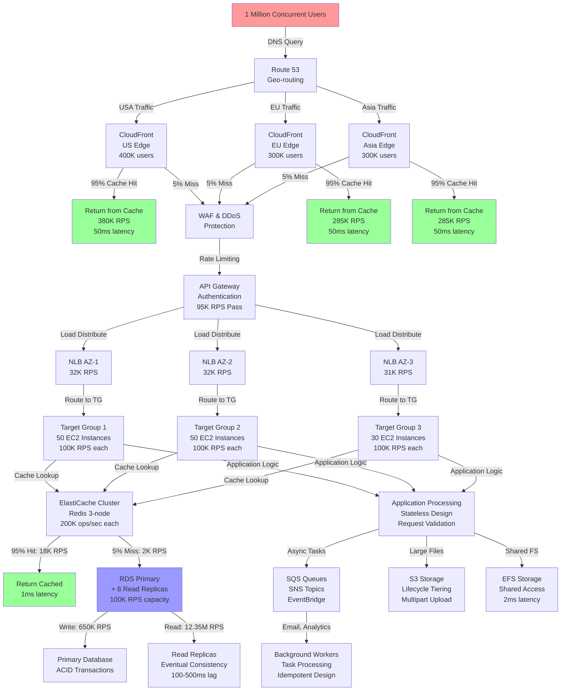
```mermaid
graph TD
    Users["1 Million Concurrent Users"] -->|DNS Query| Route53["Route 53<br/>Geo-routing"]
    
    Route53 -->|USA Traffic| CF1["CloudFront<br/>US Edge<br/>400K users"]
    Route53 -->|EU Traffic| CF2["CloudFront<br/>EU Edge<br/>300K users"]
    Route53 -->|Asia Traffic| CF3["CloudFront<br/>Asia Edge<br/>300K users"]
    
    CF1 -->|95% Cache Hit| CFReturn1["Return from Cache<br/>380K RPS<br/>50ms latency"]
    CF1 -->|5% Miss| WAF["WAF & DDoS<br/>Protection"]
    
    CF2 -->|95% Cache Hit| CFReturn2["Return from Cache<br/>285K RPS<br/>50ms latency"]
    CF2 -->|5% Miss| WAF
    
    CF3 -->|95% Cache Hit| CFReturn3["Return from Cache<br/>285K RPS<br/>50ms latency"]
    CF3 -->|5% Miss| WAF
    
    WAF -->|Rate Limiting| APIGateway["API Gateway<br/>Authentication<br/>95K RPS Pass"]
    
    APIGateway -->|Load Distribute| NLB1["NLB AZ-1<br/>32K RPS"]
    APIGateway -->|Load Distribute| NLB2["NLB AZ-2<br/>32K RPS"]
    APIGateway -->|Load Distribute| NLB3["NLB AZ-3<br/>31K RPS"]
    
    NLB1 -->|Route to TG| TG1["Target Group 1<br/>50 EC2 Instances<br/>100K RPS each"]
    NLB2 -->|Route to TG| TG2["Target Group 2<br/>50 EC2 Instances<br/>100K RPS each"]
    NLB3 -->|Route to TG| TG3["Target Group 3<br/>30 EC2 Instances<br/>100K RPS each"]
    
    TG1 -->|Cache Lookup| Cache["ElastiCache Cluster<br/>Redis 3-node<br/>200K ops/sec each"]
    TG2 -->|Cache Lookup| Cache
    TG3 -->|Cache Lookup| Cache
    
    Cache -->|95% Hit: 18K RPS| CacheReturn["Return Cached<br/>1ms latency"]
    Cache -->|5% Miss: 2K RPS| Database["RDS Primary<br/>+ 8 Read Replicas<br/>100K RPS capacity"]
    
    TG1 -->|Application Logic| AppCompute["Application Processing<br/>Stateless Design<br/>Request Validation"]
    TG2 -->|Application Logic| AppCompute
    TG3 -->|Application Logic| AppCompute
    
    AppCompute -->|Async Tasks| Queue["SQS Queues<br/>SNS Topics<br/>EventBridge"]
    Queue -->|Email, Analytics| Workers["Background Workers<br/>Task Processing<br/>Idempotent Design"]
    
    AppCompute -->|Large Files| S3["S3 Storage<br/>Lifecycle Tiering<br/>Multipart Upload"]
    AppCompute -->|Shared FS| EFS["EFS Storage<br/>Shared Access<br/>2ms latency"]
    
    Database -->|Write: 650K RPS| DBWrite["Primary Database<br/>ACID Transactions"]
    Database -->|Read: 12.35M RPS| DBRead["Read Replicas<br/>Eventual Consistency<br/>100-500ms lag"]
    
    style Users fill:#ff9999
    style CFReturn1 fill:#99ff99
    style CFReturn2 fill:#99ff99
    style CFReturn3 fill:#99ff99
    style CacheReturn fill:#99ff99
    style Database fill:#9999ff
```

---

## 2. Database Layer - Sharding & Replication Strategy

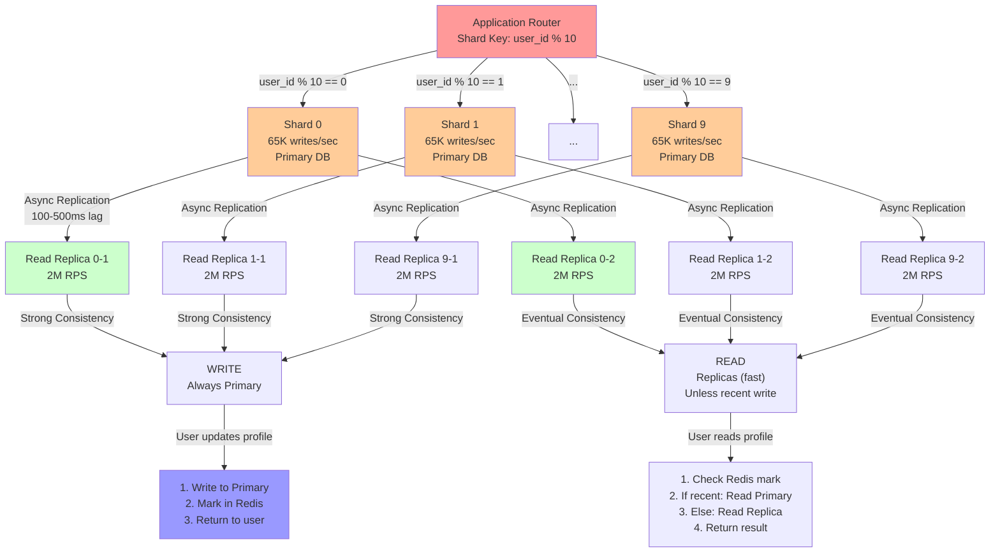
```mermaid
graph TB
    AppRouter["Application Router<br/>Shard Key: user_id % 10"]
    
    AppRouter -->|user_id % 10 == 0| Shard0["Shard 0<br/>65K writes/sec<br/>Primary DB"]
    AppRouter -->|user_id % 10 == 1| Shard1["Shard 1<br/>65K writes/sec<br/>Primary DB"]
    AppRouter -->|...| ShardDots["..."]
    AppRouter -->|user_id % 10 == 9| Shard9["Shard 9<br/>65K writes/sec<br/>Primary DB"]
    
    Shard0 -->|Async Replication<br/>100-500ms lag| Rep0a["Read Replica 0-1<br/>2M RPS"]
    Shard0 -->|Async Replication| Rep0b["Read Replica 0-2<br/>2M RPS"]
    
    Shard1 -->|Async Replication| Rep1a["Read Replica 1-1<br/>2M RPS"]
    Shard1 -->|Async Replication| Rep1b["Read Replica 1-2<br/>2M RPS"]
    
    Shard9 -->|Async Replication| Rep9a["Read Replica 9-1<br/>2M RPS"]
    Shard9 -->|Async Replication| Rep9b["Read Replica 9-2<br/>2M RPS"]
    
    Rep0a -->|Strong Consistency| StratWrite["WRITE<br/>Always Primary"]
    Rep0b -->|Eventual Consistency| StratRead["READ<br/>Replicas (fast)<br/>Unless recent write"]
    
    Rep1a -->|Strong Consistency| StratWrite
    Rep1b -->|Eventual Consistency| StratRead
    
    Rep9a -->|Strong Consistency| StratWrite
    Rep9b -->|Eventual Consistency| StratRead
    
    StratWrite -->|User updates profile| WritePath["1. Write to Primary<br/>2. Mark in Redis<br/>3. Return to user"]
    StratRead -->|User reads profile| ReadPath["1. Check Redis mark<br/>2. If recent: Read Primary<br/>3. Else: Read Replica<br/>4. Return result"]
    
    style AppRouter fill:#ff9999
    style Shard0 fill:#ffcc99
    style Shard1 fill:#ffcc99
    style Shard9 fill:#ffcc99
    style Rep0a fill:#ccffcc
    style Rep0b fill:#ccffcc
    style WritePath fill:#9999ff
```

---

## 3. Caching Layer - ElastiCache Topology & Patterns

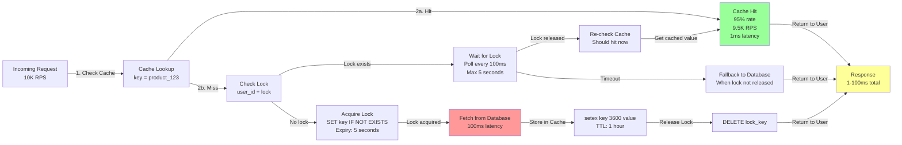
```mermaid
graph LR
    Request["Incoming Request<br/>10K RPS"]
    
    Request -->|1. Check Cache| CacheKey["Cache Lookup<br/>key = product_123"]
    
    CacheKey -->|2a. Hit| CacheHit["Cache Hit<br/>95% rate<br/>9.5K RPS<br/>1ms latency"]
    
    CacheKey -->|2b. Miss| LockCheck["Check Lock<br/>user_id + lock"]
    
    LockCheck -->|Lock exists| WaitLock["Wait for Lock<br/>Poll every 100ms<br/>Max 5 seconds"]
    
    LockCheck -->|No lock| AcquireLock["Acquire Lock<br/>SET key IF NOT EXISTS<br/>Expiry: 5 seconds"]
    
    AcquireLock -->|Lock acquired| DBFetch["Fetch from Database<br/>100ms latency"]
    
    DBFetch -->|Store in Cache| CacheWrite["setex key 3600 value<br/>TTL: 1 hour"]
    
    CacheWrite -->|Release Lock| ReleaseLock["DELETE lock_key"]
    
    WaitLock -->|Lock released| CacheRetry["Re-check Cache<br/>Should hit now"]
    CacheRetry -->|Get cached value| CacheHit
    
    WaitLock -->|Timeout| DBFallback["Fallback to Database<br/>When lock not released"]
    
    CacheHit -->|Return to User| Response["Response<br/>1-100ms total"]
    ReleaseLock -->|Return to User| Response
    DBFallback -->|Return to User| Response
    
    style CacheHit fill:#99ff99
    style DBFetch fill:#ff9999
    style Response fill:#ffff99
```

---

## 4. Autoscaling Timeline - Prevention of Cascading Failure

```mermaid
timeline
    title Autoscaling Response During Traffic Spike
    
    section Reactive Scaling (OLD - 10 min lag)
        T=0:00 : Traffic spike 100K → 300K RPS
        T=0:00 : CPU jumps to 90%
        T=1:00 : CloudWatch detects CPU > 70%
        T=2:00 : Scaling decision triggers
        T=2:30 : 20 new instances launch
        T=5:00 : AMI downloads & instances boot
        T=7:00 : Application starts on instances
        T=8:00 : Health checks pass
        T=10:00 : New instances handle traffic
        T=10:00 : CPU returns to 70%
        T=15:00 : Users experience 2-3 sec latency for 15 mins
    
    section Predictive Scaling (NEW - READY)
        T=11:55 : ML predicts peak at noon
        T=11:55 : Pre-scale to 250 instances
        T=12:00 : Traffic spike arrives
        T=12:00 : Capacity already ready
        T=12:05 : CPU = 65% (smooth)
        T=12:05 : Users experience normal latency
        T=12:05 : No spike impact
```

---

## 5. Cache Stampede Prevention - Lock Pattern

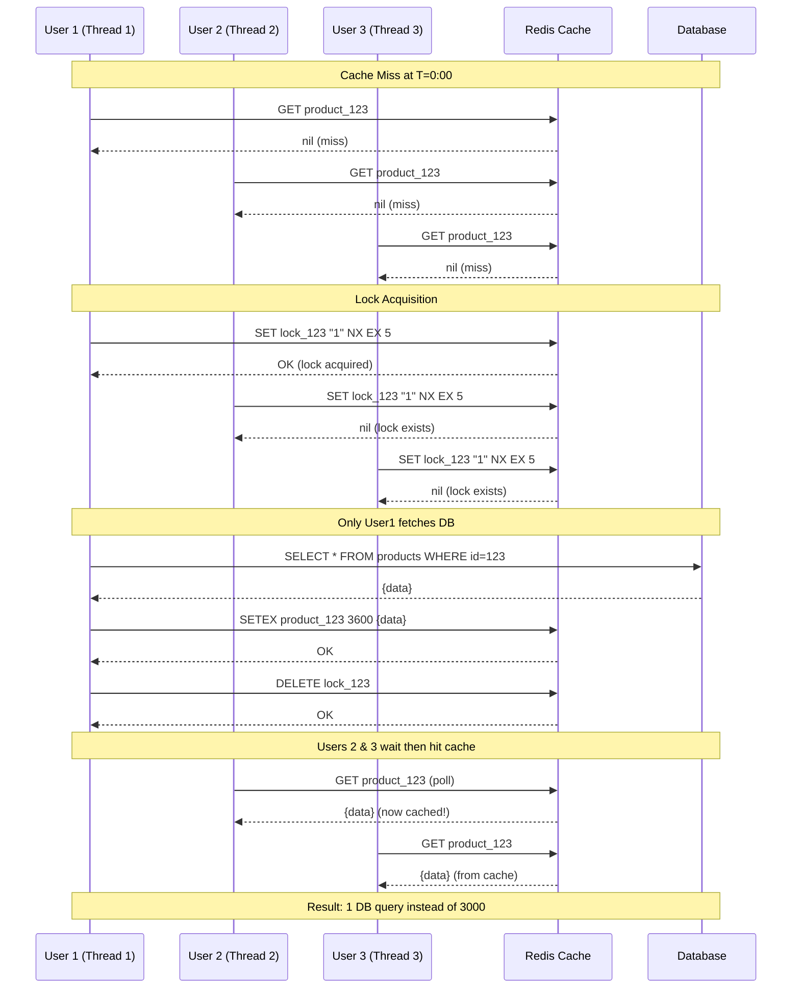
```mermaid
sequenceDiagram
    participant User1 as User 1 (Thread 1)
    participant User2 as User 2 (Thread 2)
    participant User3 as User 3 (Thread 3)
    participant Cache as Redis Cache
    participant DB as Database
    
    Note over User1,DB: Cache Miss at T=0:00
    User1->>Cache: GET product_123
    Cache-->>User1: nil (miss)
    
    User2->>Cache: GET product_123
    Cache-->>User2: nil (miss)
    
    User3->>Cache: GET product_123
    Cache-->>User3: nil (miss)
    
    Note over User1,DB: Lock Acquisition
    User1->>Cache: SET lock_123 "1" NX EX 5
    Cache-->>User1: OK (lock acquired)
    
    User2->>Cache: SET lock_123 "1" NX EX 5
    Cache-->>User2: nil (lock exists)
    
    User3->>Cache: SET lock_123 "1" NX EX 5
    Cache-->>User3: nil (lock exists)
    
    Note over User1,DB: Only User1 fetches DB
    User1->>DB: SELECT * FROM products WHERE id=123
    DB-->>User1: {data}
    
    User1->>Cache: SETEX product_123 3600 {data}
    Cache-->>User1: OK
    
    User1->>Cache: DELETE lock_123
    Cache-->>User1: OK
    
    Note over User1,DB: Users 2 & 3 wait then hit cache
    User2->>Cache: GET product_123 (poll)
    Cache-->>User2: {data} (now cached!)
    
    User3->>Cache: GET product_123
    Cache-->>User3: {data} (from cache)
    
    Note over User1,DB: Result: 1 DB query instead of 3000
```

---

## 6. Edge Layer Architecture - CloudFront Distribution

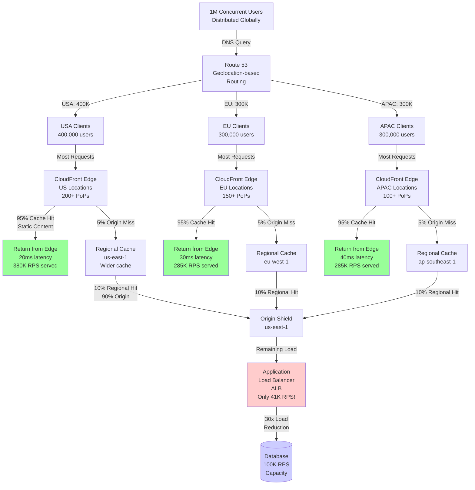
```mermaid
graph TD
    Users["1M Concurrent Users<br/>Distributed Globally"]
    
    Users -->|DNS Query| Route53["Route 53<br/>Geolocation-based<br/>Routing"]
    
    Route53 -->|USA: 400K| USClients["USA Clients<br/>400,000 users"]
    Route53 -->|EU: 300K| EUClients["EU Clients<br/>300,000 users"]
    Route53 -->|APAC: 300K| APACClients["APAC Clients<br/>300,000 users"]
    
    USClients -->|Most Requests| CFEdge1["CloudFront Edge<br/>US Locations<br/>200+ PoPs"]
    EUClients -->|Most Requests| CFEdge2["CloudFront Edge<br/>EU Locations<br/>150+ PoPs"]
    APACClients -->|Most Requests| CFEdge3["CloudFront Edge<br/>APAC Locations<br/>100+ PoPs"]
    
    CFEdge1 -->|95% Cache Hit<br/>Static Content| Return1["Return from Edge<br/>20ms latency<br/>380K RPS served"]
    CFEdge1 -->|5% Origin Miss| Regional1["Regional Cache<br/>us-east-1<br/>Wider cache"]
    
    CFEdge2 -->|95% Cache Hit| Return2["Return from Edge<br/>30ms latency<br/>285K RPS served"]
    CFEdge2 -->|5% Origin Miss| Regional2["Regional Cache<br/>eu-west-1"]
    
    CFEdge3 -->|95% Cache Hit| Return3["Return from Edge<br/>40ms latency<br/>285K RPS served"]
    CFEdge3 -->|5% Origin Miss| Regional3["Regional Cache<br/>ap-southeast-1"]
    
    Regional1 -->|10% Regional Hit<br/>90% Origin| Origins["Origin Shield<br/>us-east-1"]
    Regional2 -->|10% Regional Hit| Origins
    Regional3 -->|10% Regional Hit| Origins
    
    Origins -->|Remaining Load| ALB["Application<br/>Load Balancer<br/>ALB<br/>Only 41K RPS!"]
    
    ALB -->|30x Load<br/>Reduction| DB[(Database<br/>100K RPS<br/>Capacity)]
    
    style Return1 fill:#99ff99
    style Return2 fill:#99ff99
    style Return3 fill:#99ff99
    style ALB fill:#ffcccc
    style DB fill:#ccccff
```

---

## 7. Load Estimation Breakdown

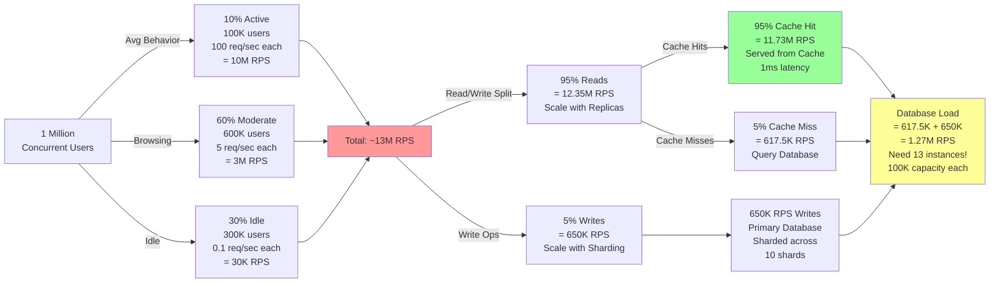
```mermaid
graph LR
    Start["1 Million<br/>Concurrent Users"] -->|Avg Behavior| ActiveUsers["10% Active<br/>100K users<br/>100 req/sec each<br/>= 10M RPS"]
    
    Start -->|Browsing| ModeUsers["60% Moderate<br/>600K users<br/>5 req/sec each<br/>= 3M RPS"]
    
    Start -->|Idle| IdleUsers["30% Idle<br/>300K users<br/>0.1 req/sec each<br/>= 30K RPS"]
    
    ActiveUsers --> Total["Total: ~13M RPS"]
    ModeUsers --> Total
    IdleUsers --> Total
    
    Total -->|Read/Write Split| ReadOps["95% Reads<br/>= 12.35M RPS<br/>Scale with Replicas"]
    
    Total -->|Write Ops| WriteOps["5% Writes<br/>= 650K RPS<br/>Scale with Sharding"]
    
    ReadOps -->|Cache Hits| CacheReads["95% Cache Hit<br/>= 11.73M RPS<br/>Served from Cache<br/>1ms latency"]
    
    ReadOps -->|Cache Misses| DBReads["5% Cache Miss<br/>= 617.5K RPS<br/>Query Database"]
    
    WriteOps --> DBWrites["650K RPS Writes<br/>Primary Database<br/>Sharded across<br/>10 shards"]
    
    CacheReads --> Result["Database Load<br/>= 617.5K + 650K<br/>= 1.27M RPS<br/>Need 13 instances!<br/>100K capacity each"]
    DBReads --> Result
    DBWrites --> Result
    
    style Total fill:#ff9999
    style CacheReads fill:#99ff99
    style Result fill:#ffff99
```

---

## 8. Async Processing - Message Flow Pattern

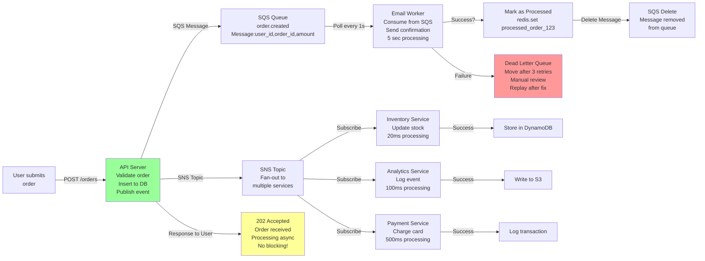
```mermaid
graph LR
    User["User submits<br/>order"]
    
    User -->|POST /orders| API["API Server<br/>Validate order<br/>Insert to DB<br/>Publish event"]
    
    API -->|SQS Message| Queue["SQS Queue<br/>order.created<br/>Message:user_id,order_id,amount"]
    
    API -->|SNS Topic| Fanout["SNS Topic<br/>Fan-out to<br/>multiple services"]
    
    Queue -->|Poll every 1s| Worker1["Email Worker<br/>Consume from SQS<br/>Send confirmation<br/>5 sec processing"]
    
    Fanout -->|Subscribe| Service1["Inventory Service<br/>Update stock<br/>20ms processing"]
    
    Fanout -->|Subscribe| Service2["Analytics Service<br/>Log event<br/>100ms processing"]
    
    Fanout -->|Subscribe| Service3["Payment Service<br/>Charge card<br/>500ms processing"]
    
    Worker1 -->|Success?| Mark1["Mark as Processed<br/>redis.set processed_order_123"]
    
    Service1 -->|Success| Mark2["Store in DynamoDB"]
    Service2 -->|Success| Mark3["Write to S3"]
    Service3 -->|Success| Mark4["Log transaction"]
    
    Mark1 -->|Delete Message| Delete["SQS Delete<br/>Message removed<br/>from queue"]
    
    Worker1 -->|Failure| DLQ["Dead Letter Queue<br/>Move after 3 retries<br/>Manual review<br/>Replay after fix"]
    
    API -->|Response to User| UserResp["202 Accepted<br/>Order received<br/>Processing async<br/>No blocking!"]
    
    style API fill:#99ff99
    style UserResp fill:#ffff99
    style DLQ fill:#ff9999
```

---

## 9. Regional Failover - Active/Passive Strategy

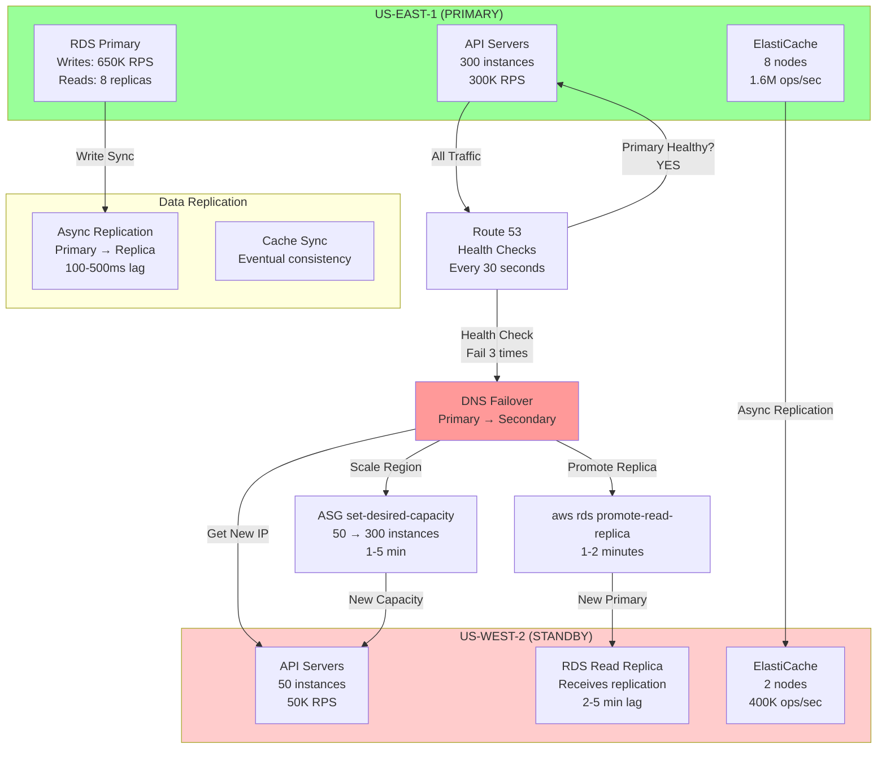
```mermaid
graph TB
    subgraph Primary["US-EAST-1 (PRIMARY)"]
        API1["API Servers<br/>300 instances<br/>300K RPS"]
        DB1["RDS Primary<br/>Writes: 650K RPS<br/>Reads: 8 replicas"]
        Cache1["ElastiCache<br/>8 nodes<br/>1.6M ops/sec"]
    end
    
    subgraph Standby["US-WEST-2 (STANDBY)"]
        API2["API Servers<br/>50 instances<br/>50K RPS"]
        DB2["RDS Read Replica<br/>Receives replication<br/>2-5 min lag"]
        Cache2["ElastiCache<br/>2 nodes<br/>400K ops/sec"]
    end
    
    subgraph Replication["Data Replication"]
        DBRep["Async Replication<br/>Primary → Replica<br/>100-500ms lag"]
        CacheRep["Cache Sync<br/>Eventual consistency"]
    end
    
    Route53["Route 53<br/>Health Checks<br/>Every 30 seconds"]
    
    API1 -->|All Traffic| Route53
    DB1 -->|Write Sync| DBRep
    Cache1 -->|Async Replication| Cache2
    
    Route53 -->|Primary Healthy?<br/>YES| API1
    Route53 -->|Health Check<br/>Fail 3 times| Failover["DNS Failover<br/>Primary → Secondary"]
    
    Failover -->|Get New IP| API2
    Failover -->|Promote Replica| PromoteDB["aws rds promote-read-replica<br/>1-2 minutes"]
    Failover -->|Scale Region| Scale["ASG set-desired-capacity<br/>50 → 300 instances<br/>1-5 min"]
    
    PromoteDB -->|New Primary| DB2
    Scale -->|New Capacity| API2
    
    style Primary fill:#99ff99
    style Standby fill:#ffcccc
    style Failover fill:#ff9999
```

---

## 10. Cost Breakdown - Optimization Path

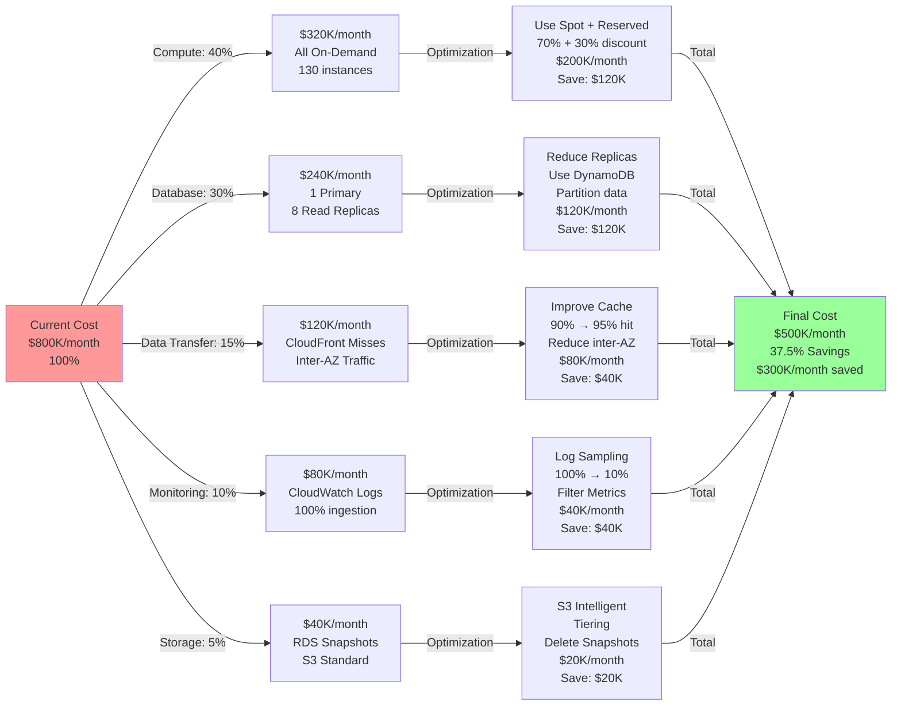
```mermaid
graph LR
    Start["Current Cost<br/>$800K/month<br/>100%"]
    
    Start -->|Compute: 40%| Compute["$320K/month<br/>All On-Demand<br/>130 instances"]
    
    Start -->|Database: 30%| Database["$240K/month<br/>1 Primary<br/>8 Read Replicas"]
    
    Start -->|Data Transfer: 15%| Transfer["$120K/month<br/>CloudFront Misses<br/>Inter-AZ Traffic"]
    
    Start -->|Monitoring: 10%| Monitoring["$80K/month<br/>CloudWatch Logs<br/>100% ingestion"]
    
    Start -->|Storage: 5%| Storage["$40K/month<br/>RDS Snapshots<br/>S3 Standard"]
    
    Compute -->|Optimization| OptComp["Use Spot + Reserved<br/>70% + 30% discount<br/>$200K/month<br/>Save: $120K"]
    
    Database -->|Optimization| OptDB["Reduce Replicas<br/>Use DynamoDB<br/>Partition data<br/>$120K/month<br/>Save: $120K"]
    
    Transfer -->|Optimization| OptTrans["Improve Cache<br/>90% → 95% hit<br/>Reduce inter-AZ<br/>$80K/month<br/>Save: $40K"]
    
    Monitoring -->|Optimization| OptMon["Log Sampling<br/>100% → 10%<br/>Filter Metrics<br/>$40K/month<br/>Save: $40K"]
    
    Storage -->|Optimization| OptStor["S3 Intelligent<br/>Tiering<br/>Delete Snapshots<br/>$20K/month<br/>Save: $20K"]
    
    OptComp -->|Total| Result["Final Cost<br/>$500K/month<br/>37.5% Savings<br/>$300K/month saved"]
    OptDB -->|Total| Result
    OptTrans -->|Total| Result
    OptMon -->|Total| Result
    OptStor -->|Total| Result
    
    style Start fill:#ff9999
    style Result fill:#99ff99
```

---

## 11. P99 Latency Distribution - Budget Analysis

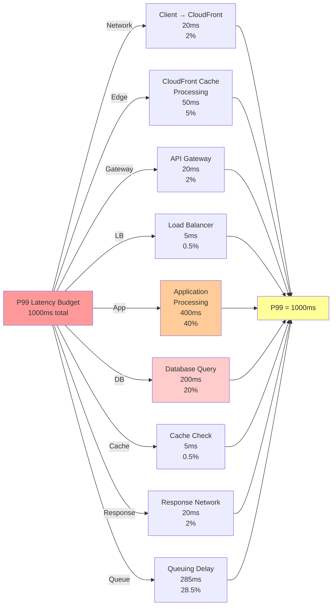
```mermaid
graph LR
    Budget["P99 Latency Budget<br/>1000ms total"] -->|Network| Net["Client → CloudFront<br/>20ms<br/>2%"]
    
    Budget -->|Edge| Edge["CloudFront Cache<br/>Processing<br/>50ms<br/>5%"]
    
    Budget -->|Gateway| Gw["API Gateway<br/>20ms<br/>2%"]
    
    Budget -->|LB| LB["Load Balancer<br/>5ms<br/>0.5%"]
    
    Budget -->|App| App["Application<br/>Processing<br/>400ms<br/>40%"]
    
    Budget -->|DB| DB["Database Query<br/>200ms<br/>20%"]
    
    Budget -->|Cache| Cache["Cache Check<br/>5ms<br/>0.5%"]
    
    Budget -->|Response| Resp["Response Network<br/>20ms<br/>2%"]
    
    Budget -->|Queue| Queue["Queuing Delay<br/>285ms<br/>28.5%"]
    
    Net --> Total["P99 = 1000ms"]
    Edge --> Total
    Gw --> Total
    LB --> Total
    App --> Total
    DB --> Total
    Cache --> Total
    Resp --> Total
    Queue --> Total
    
    style Budget fill:#ff9999
    style App fill:#ffcc99
    style DB fill:#ffcccc
    style Total fill:#ffff99
```

---

## 12. Monitoring Strategy - Alert Matrix

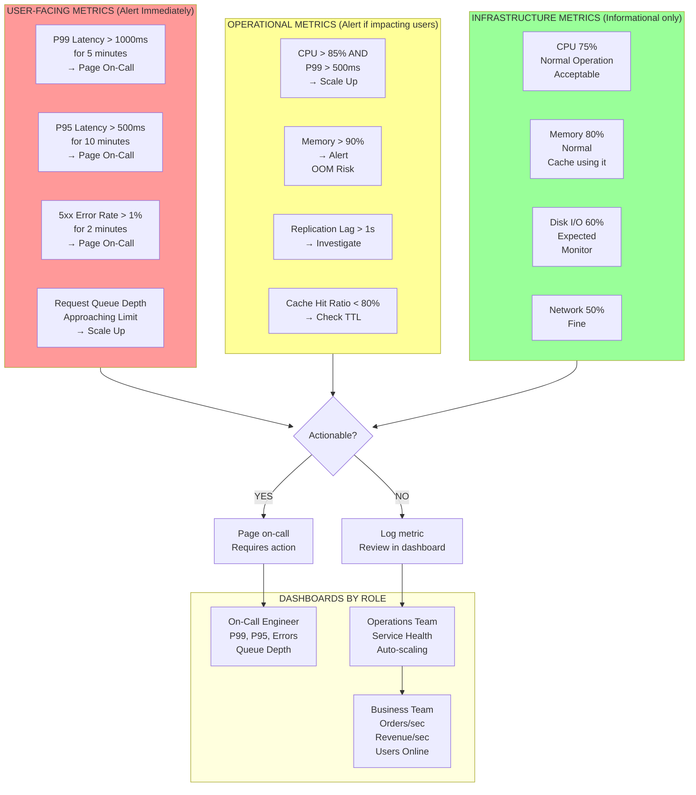
```mermaid
graph TD
    subgraph UserImpact["USER-FACING METRICS (Alert Immediately)"]
        P99["P99 Latency > 1000ms<br/>for 5 minutes<br/>→ Page On-Call"]
        P95["P95 Latency > 500ms<br/>for 10 minutes<br/>→ Page On-Call"]
        Errors["5xx Error Rate > 1%<br/>for 2 minutes<br/>→ Page On-Call"]
        Queue["Request Queue Depth<br/>Approaching Limit<br/>→ Scale Up"]
    end
    
    subgraph Operational["OPERATIONAL METRICS (Alert if impacting users)"]
        CPU["CPU > 85% AND<br/>P99 > 500ms<br/>→ Scale Up"]
        Memory["Memory > 90%<br/>→ Alert<br/>OOM Risk"]
        ReplicaLag["Replication Lag > 1s<br/>→ Investigate"]
        CacheHit["Cache Hit Ratio < 80%<br/>→ Check TTL"]
    end
    
    subgraph Infrastructure["INFRASTRUCTURE METRICS (Informational only)"]
        CPU75["CPU 75%<br/>Normal Operation<br/>Acceptable"]
        Memory80["Memory 80%<br/>Normal<br/>Cache using it"]
        DiskIO["Disk I/O 60%<br/>Expected<br/>Monitor"]
        Network["Network 50%<br/>Fine"]
    end
    
    subgraph Dashboards["DASHBOARDS BY ROLE"]
        On["On-Call Engineer<br/>P99, P95, Errors<br/>Queue Depth"]
        Ops["Operations Team<br/>Service Health<br/>Auto-scaling"]
        Biz["Business Team<br/>Orders/sec<br/>Revenue/sec<br/>Users Online"]
    end
    
    UserImpact --> Decision{Actionable?}
    Operational --> Decision
    Infrastructure --> Decision
    
    Decision -->|YES| OnPage["Page on-call<br/>Requires action"]
    Decision -->|NO| Dashboard["Log metric<br/>Review in dashboard"]
    
    OnPage --> On
    Dashboard --> Ops
    Ops --> Biz
    
    style UserImpact fill:#ff9999
    style Operational fill:#ffff99
    style Infrastructure fill:#99ff99
```

---

## 13. Database Failover Process - Sequential Steps

```mermaid
sequenceDiagram
    participant Monitor as CloudWatch
    participant Route53 as Route 53
    participant Lambda as Lambda Function
    participant RDS as RDS Service
    participant App as Application Servers
    participant Users as End Users
    
    Monitor->>Monitor: Primary DB CPU = 0%<br/>Connections = 0
    
    Monitor->>Route53: Health Check Failed<br/>Primary Unhealthy
    
    Note over Route53: Wait 3 failures = 90 seconds
    
    Route53->>Lambda: Trigger Failover Function<br/>Primary Region Failed
    
    Lambda->>RDS: Promote Read Replica<br/>us-west-2-replica
    
    Note over RDS: Promotion takes 1-2 minutes
    
    RDS-->>Lambda: Promotion Complete
    
    Lambda->>Route53: Update DNS Record<br/>api.example.com<br/>→ us-west-2 IP
    
    Note over Route53: DNS TTL = 60 seconds<br/>Propagation = 10ms
    
    Route53->>App: DNS Answer Updated<br/>New IP for us-west-2
    
    Lambda->>App: Signal Auto-Scaling<br/>Set Desired Capacity<br/>50 → 300 instances
    
    Note over App: Instance launch = 3-5 minutes
    
    Users->>Route53: DNS Query<br/>api.example.com
    
    Route53-->>Users: New IP (us-west-2)
    
    Users->>App: Connect to us-west-2
    
    Note over Users: Most clients connect<br/>within 1-3 minutes
    
    App-->>Users: Service Restored<br/>Minimal outage<br/>2-3 minutes total
    
    style Monitor fill:#ff9999
    style Lambda fill:#99ff99
    style Users fill:#ffffcc
```

---

## 14. Sharding Hot Spot Detection & Resolution

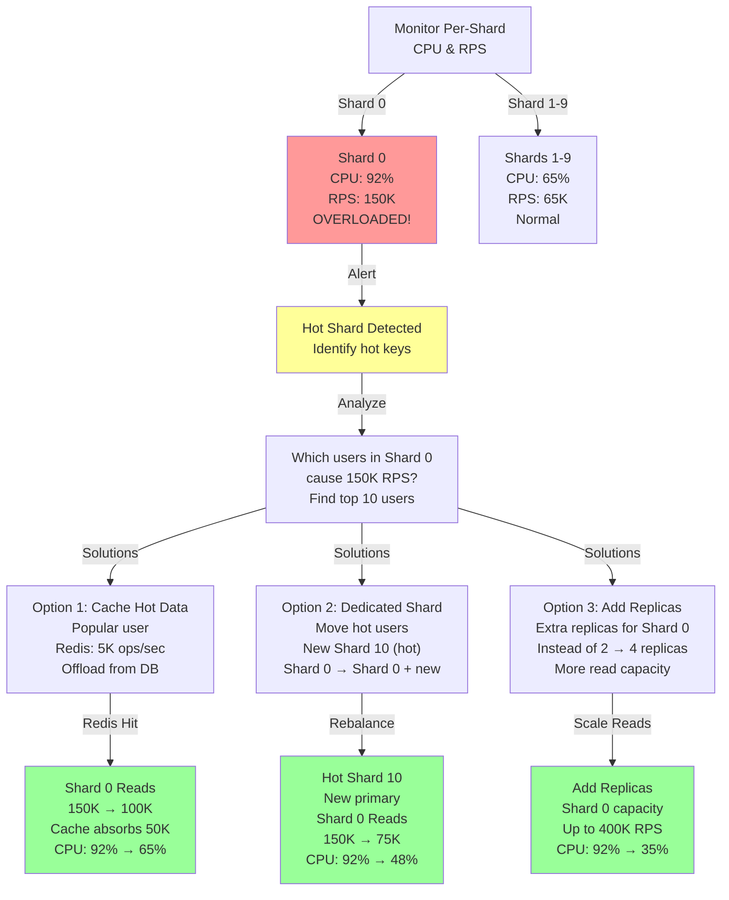
```mermaid
graph TD
    Monitor["Monitor Per-Shard<br/>CPU & RPS"]
    
    Monitor -->|Shard 0| Shard0["Shard 0<br/>CPU: 92%<br/>RPS: 150K<br/>OVERLOADED!"]
    
    Monitor -->|Shard 1-9| Normal["Shards 1-9<br/>CPU: 65%<br/>RPS: 65K<br/>Normal"]
    
    Shard0 -->|Alert| Detect["Hot Shard Detected<br/>Identify hot keys"]
    
    Detect -->|Analyze| Analysis["Which users in Shard 0<br/>cause 150K RPS?<br/>Find top 10 users"]
    
    Analysis -->|Solutions| Option1["Option 1: Cache Hot Data<br/>Popular user<br/>Redis: 5K ops/sec<br/>Offload from DB"]
    
    Analysis -->|Solutions| Option2["Option 2: Dedicated Shard<br/>Move hot users<br/>New Shard 10 (hot)<br/>Shard 0 → Shard 0 + new"]
    
    Analysis -->|Solutions| Option3["Option 3: Add Replicas<br/>Extra replicas for Shard 0<br/>Instead of 2 → 4 replicas<br/>More read capacity"]
    
    Option1 -->|Redis Hit| Result1["Shard 0 Reads<br/>150K → 100K<br/>Cache absorbs 50K<br/>CPU: 92% → 65%"]
    
    Option2 -->|Rebalance| Result2["Hot Shard 10<br/>New primary<br/>Shard 0 Reads<br/>150K → 75K<br/>CPU: 92% → 48%"]
    
    Option3 -->|Scale Reads| Result3["Add Replicas<br/>Shard 0 capacity<br/>Up to 400K RPS<br/>CPU: 92% → 35%"]
    
    style Shard0 fill:#ff9999
    style Detect fill:#ffff99
    style Result1 fill:#99ff99
    style Result2 fill:#99ff99
    style Result3 fill:#99ff99
```

---

## 15. Graceful Degradation - Circuit Breaker Pattern

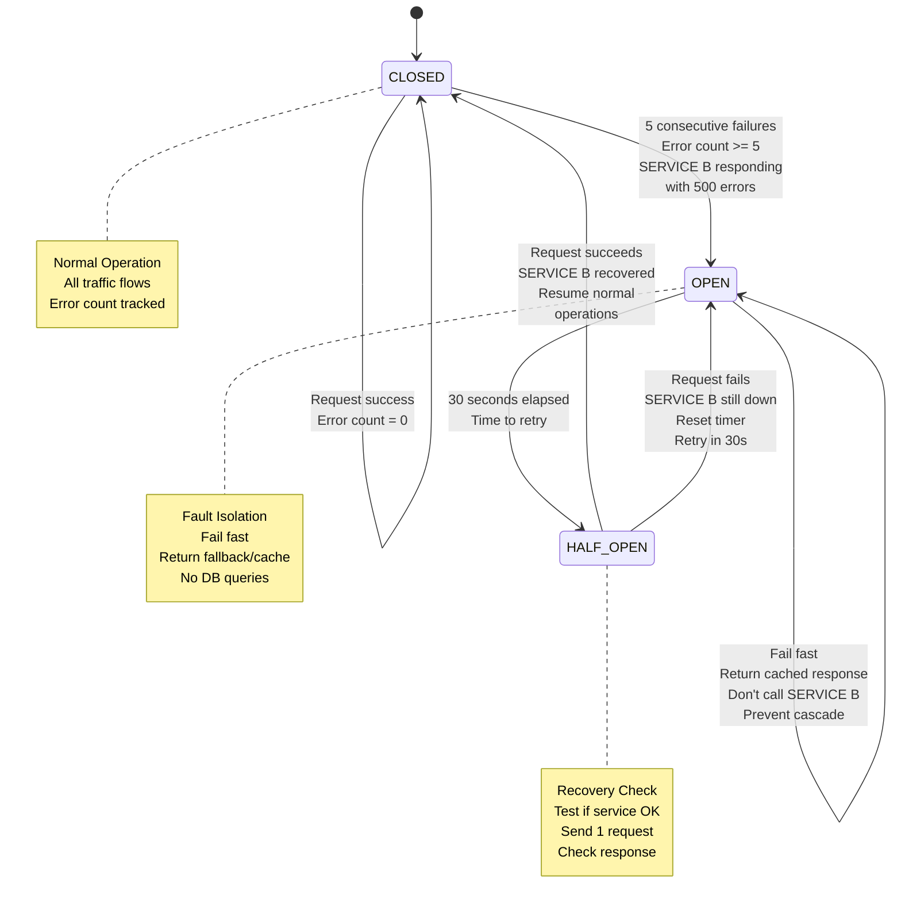
```mermaid
stateDiagram-v2
    [*] --> CLOSED
    
    CLOSED --> CLOSED: Request success<br/>Error count = 0
    
    CLOSED --> OPEN: 5 consecutive failures<br/>Error count >= 5<br/>SERVICE B responding<br/>with 500 errors
    
    OPEN --> OPEN: Fail fast<br/>Return cached response<br/>Don't call SERVICE B<br/>Prevent cascade
    
    OPEN --> HALF_OPEN: 30 seconds elapsed<br/>Time to retry
    
    HALF_OPEN --> CLOSED: Request succeeds<br/>SERVICE B recovered<br/>Resume normal<br/>operations
    
    HALF_OPEN --> OPEN: Request fails<br/>SERVICE B still down<br/>Reset timer<br/>Retry in 30s
    
    note right of CLOSED
        Normal Operation
        All traffic flows
        Error count tracked
    end note
    
    note right of OPEN
        Fault Isolation
        Fail fast
        Return fallback/cache
        No DB queries
    end note
    
    note right of HALF_OPEN
        Recovery Check
        Test if service OK
        Send 1 request
        Check response
    end note
```

---

## 16. Blue-Green Deployment Strategy

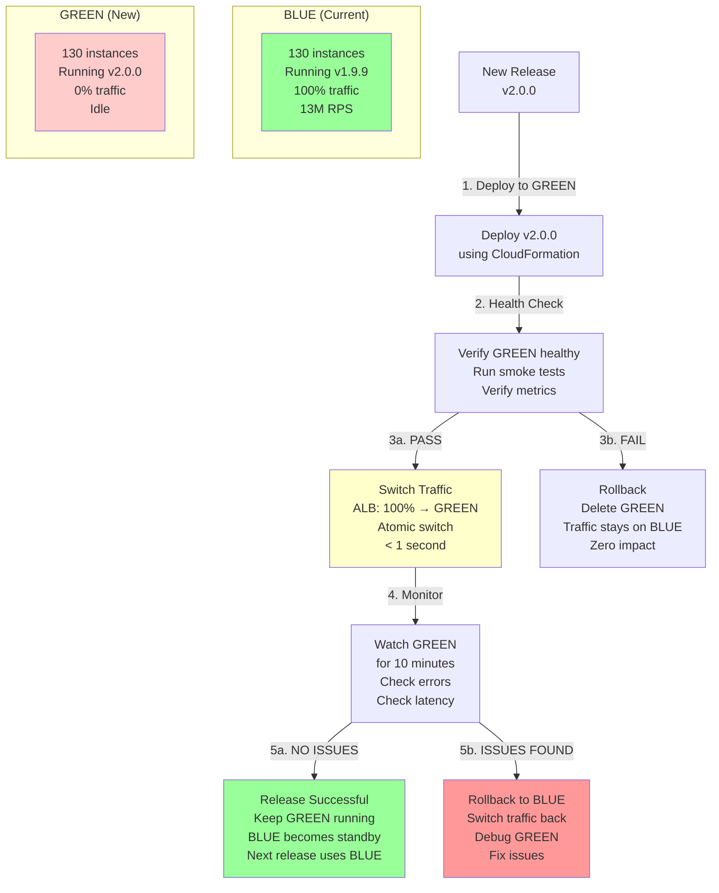
```mermaid
graph TB
    Release["New Release<br/>v2.0.0"]
    
    subgraph Current["BLUE (Current)"]
        B["130 instances<br/>Running v1.9.9<br/>100% traffic<br/>13M RPS"]
    end
    
    subgraph NewEnv["GREEN (New)"]
        G["130 instances<br/>Running v2.0.0<br/>0% traffic<br/>Idle"]
    end
    
    Release -->|1. Deploy to GREEN| Deploy["Deploy v2.0.0<br/>using CloudFormation"]
    
    Deploy -->|2. Health Check| HealthCheck["Verify GREEN healthy<br/>Run smoke tests<br/>Verify metrics"]
    
    HealthCheck -->|3a. PASS| Switch["Switch Traffic<br/>ALB: 100% → GREEN<br/>Atomic switch<br/>< 1 second"]
    
    HealthCheck -->|3b. FAIL| Rollback["Rollback<br/>Delete GREEN<br/>Traffic stays on BLUE<br/>Zero impact"]
    
    Switch -->|4. Monitor| Monitor["Watch GREEN<br/>for 10 minutes<br/>Check errors<br/>Check latency"]
    
    Monitor -->|5a. NO ISSUES| Success["Release Successful<br/>Keep GREEN running<br/>BLUE becomes standby<br/>Next release uses BLUE"]
    
    Monitor -->|5b. ISSUES FOUND| RollbackMon["Rollback to BLUE<br/>Switch traffic back<br/>Debug GREEN<br/>Fix issues"]
    
    style B fill:#99ff99
    style G fill:#ffcccc
    style Switch fill:#ffffcc
    style Success fill:#99ff99
    style RollbackMon fill:#ff9999
```

---

## 17. Concurrency vs Throughput - Load Model

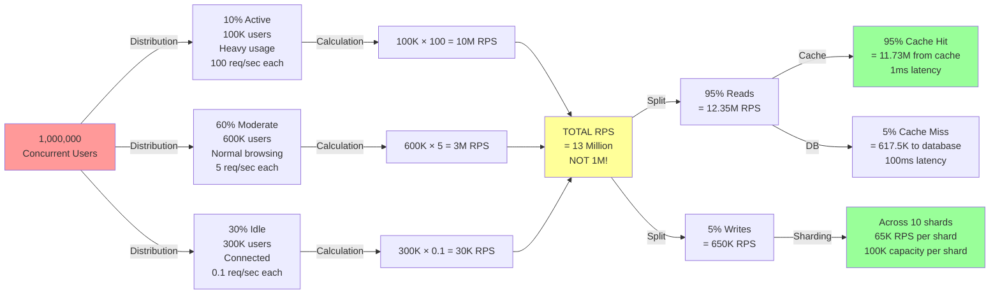
```mermaid
graph LR
    Concurrent["1,000,000<br/>Concurrent Users"]
    
    Concurrent -->|Distribution| Active["10% Active<br/>100K users<br/>Heavy usage<br/>100 req/sec each"]
    
    Concurrent -->|Distribution| Moderate["60% Moderate<br/>600K users<br/>Normal browsing<br/>5 req/sec each"]
    
    Concurrent -->|Distribution| Idle["30% Idle<br/>300K users<br/>Connected<br/>0.1 req/sec each"]
    
    Active -->|Calculation| ActiveRPS["100K × 100 = 10M RPS"]
    Moderate -->|Calculation| ModRPS["600K × 5 = 3M RPS"]
    Idle -->|Calculation| IdleRPS["300K × 0.1 = 30K RPS"]
    
    ActiveRPS --> Total["TOTAL RPS<br/>= 13 Million<br/>NOT 1M!"]
    ModRPS --> Total
    IdleRPS --> Total
    
    Total -->|Split| ReadRPS["95% Reads<br/>= 12.35M RPS"]
    Total -->|Split| WriteRPS["5% Writes<br/>= 650K RPS"]
    
    ReadRPS -->|Cache| CacheRPS["95% Cache Hit<br/>= 11.73M from cache<br/>1ms latency"]
    ReadRPS -->|DB| DBReadRPS["5% Cache Miss<br/>= 617.5K to database<br/>100ms latency"]
    
    WriteRPS -->|Sharding| ShardRPS["Across 10 shards<br/>65K RPS per shard<br/>100K capacity per shard"]
    
    style Concurrent fill:#ff9999
    style Total fill:#ffff99
    style CacheRPS fill:#99ff99
    style ShardRPS fill:#99ff99
```

---

## 18. Multi-AZ Failover Impact

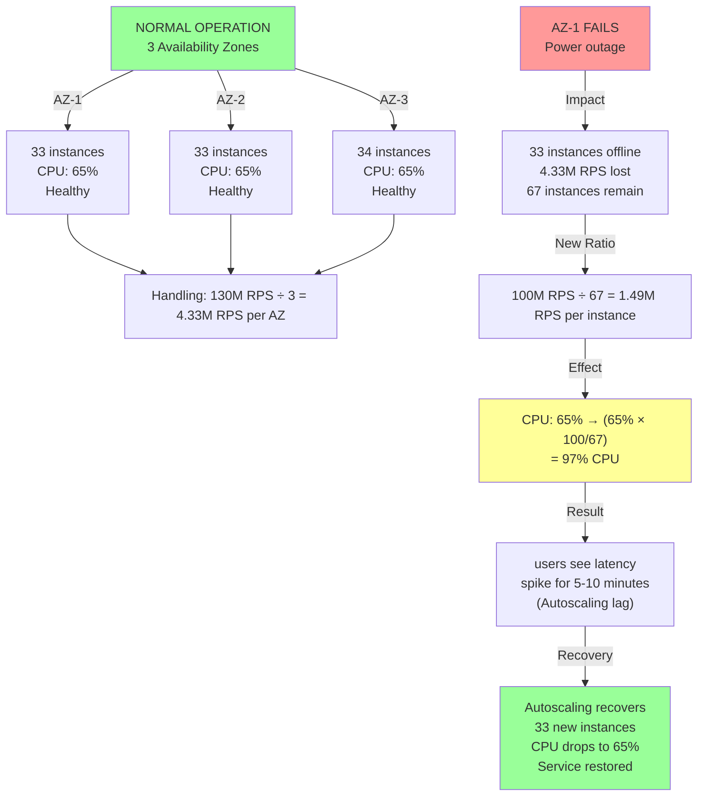
```mermaid
graph TD
    Normal["NORMAL OPERATION<br/>3 Availability Zones"]
    
    Normal -->|AZ-1| AZ1["33 instances<br/>CPU: 65%<br/>Healthy"]
    Normal -->|AZ-2| AZ2["33 instances<br/>CPU: 65%<br/>Healthy"]
    Normal -->|AZ-3| AZ3["34 instances<br/>CPU: 65%<br/>Healthy"]
    
    AZ1 --> Handling["Handling: 130M RPS ÷ 3 = 4.33M RPS per AZ"]
    AZ2 --> Handling
    AZ3 --> Handling
    
    Failure["AZ-1 FAILS<br/>Power outage"]
    
    Failure -->|Impact| Lost["33 instances offline<br/>4.33M RPS lost<br/>67 instances remain"]
    
    Lost -->|New Ratio| NewLoad["100M RPS ÷ 67 = 1.49M RPS per instance"]
    
    NewLoad -->|Effect| CPUJump["CPU: 65% → (65% × 100/67)<br/>= 97% CPU"]
    
    CPUJump -->|Result| Impact["users see latency<br/>spike for 5-10 minutes<br/>(Autoscaling lag)"]
    
    Impact -->|Recovery| Recovery["Autoscaling recovers<br/>33 new instances<br/>CPU drops to 65%<br/>Service restored"]
    
    style Normal fill:#99ff99
    style Failure fill:#ff9999
    style CPUJump fill:#ffff99
    style Recovery fill:#99ff99
```

---

## 19. Message Processing - Idempotency Pattern

```mermaid
sequenceDiagram
    participant Queue as SQS Queue
    participant Redis as Redis Store
    participant Worker as Worker Process
    participant DB as Database
    participant Handler as Handler
    
    Note over Queue,Handler: First Attempt (Success)
    Queue->>Worker: Receive Message<br/>Message ID: msg_123<br/>Order ID: order_456<br/>Visibility Timeout: 60s
    
    Worker->>Redis: Check if processed<br/>GET processed_order_456
    Redis-->>Worker: nil (not processed)
    
    Worker->>DB: Process order<br/>INSERT transaction
    DB-->>Worker: Success
    
    Worker->>Redis: Mark as processed<br/>SET processed_order_456 1
    Redis-->>Worker: OK
    
    Worker->>Queue: Delete message<br/>Message removed
    
    Note over Queue,Handler: Re-delivery (Duplicate Prevention)
    Queue->>Worker: Receive Message<br/>msg_123 (again)<br/>Visibility timeout<br/>expired
    
    Worker->>Redis: Check if processed<br/>GET processed_order_456
    Redis-->>Worker: 1 (already processed!)
    
    Worker->>Queue: Still delete message<br/>Skip processing<br/>No duplicate!
    
    Note over Queue,Handler: Result
    Handler->>Handler: Database has<br/>1 transaction (correct)<br/>No duplicates<br/>Idempotency achieved
    
    style Worker fill:#99ff99
    style Redis fill:#ffffcc
```

---

## 20. Read-After-Write Consistency Implementation

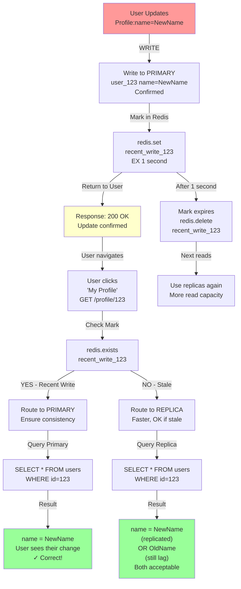
```mermaid
graph TD
    User["User Updates<br/>Profile:name=NewName"]
    
    User -->|WRITE| Primary["Write to PRIMARY<br/>user_123 name=NewName<br/>Confirmed"]
    
    Primary -->|Mark in Redis| Mark["redis.set<br/>recent_write_123<br/>EX 1 second"]
    
    Mark -->|Return to User| Response["Response: 200 OK<br/>Update confirmed"]
    
    Response -->|User navigates| ReadReq["User clicks<br/>'My Profile'<br/>GET /profile/123"]
    
    ReadReq -->|Check Mark| CheckMark["redis.exists<br/>recent_write_123"]
    
    CheckMark -->|YES - Recent Write| UsePrimary["Route to PRIMARY<br/>Ensure consistency"]
    
    UsePrimary -->|Query Primary| PrimaryRead["SELECT * FROM users<br/>WHERE id=123"]
    
    PrimaryRead -->|Result| Result1["name = NewName<br/>User sees their change<br/>✓ Correct!"]
    
    CheckMark -->|NO - Stale| UseReplica["Route to REPLICA<br/>Faster, OK if stale"]
    
    UseReplica -->|Query Replica| ReplicaRead["SELECT * FROM users<br/>WHERE id=123"]
    
    ReplicaRead -->|Result| Result2["name = NewName<br/>(replicated)<br/>OR OldName<br/>(still lag)<br/>Both acceptable"]
    
    Mark -->|After 1 second| Expire["Mark expires<br/>redis.delete<br/>recent_write_123"]
    
    Expire -->|Next reads| BackToReplica["Use replicas again<br/>More read capacity"]
    
    style User fill:#ff9999
    style Response fill:#ffffcc
    style Result1 fill:#99ff99
    style Result2 fill:#99ff99
```

---
