# Zero-Downtime Deployments: Mermaid Diagrams

Comprehensive visualization of zero-downtime deployment concepts, architectures, and processes.

---

## 1. Three-Phase Deployment Model (Expand-Migrate-Contract)

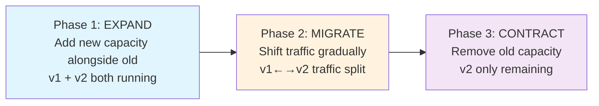

---

## 2. Kubernetes Deployment Strategies Comparison

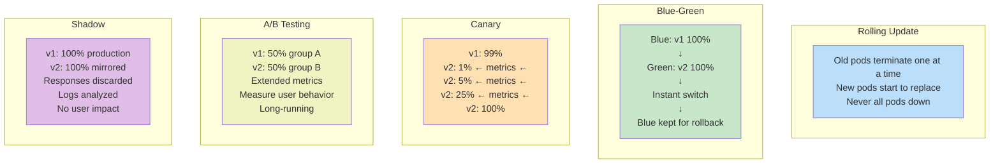

---

## 3. Canary Deployment Pipeline

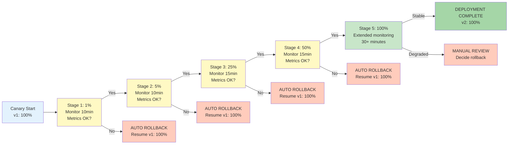

---

## 4. Liveness vs Readiness Probes

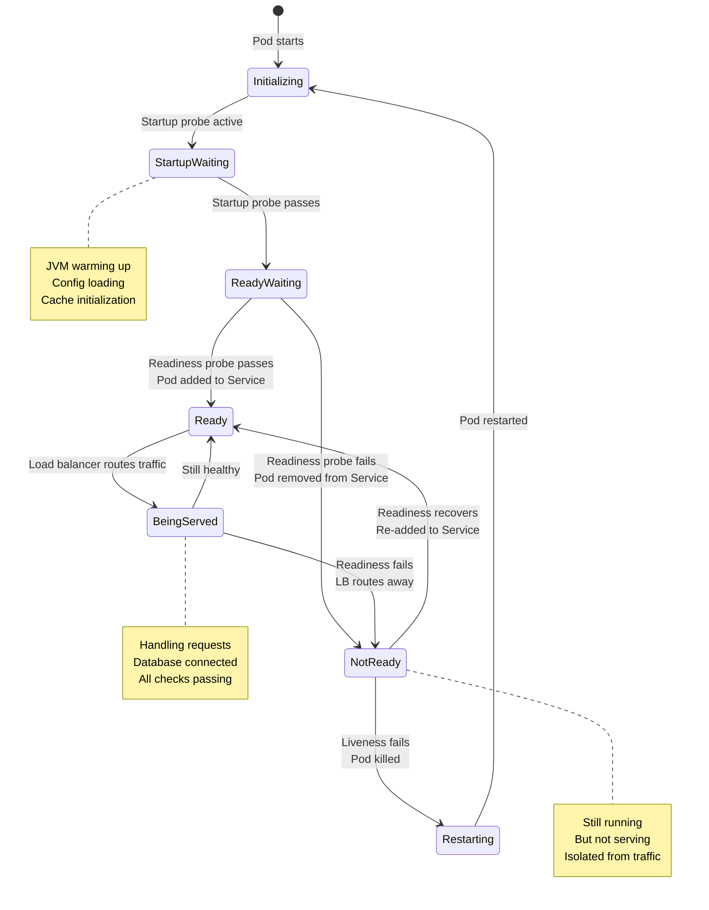

---

## 5. Connection Draining Timeline

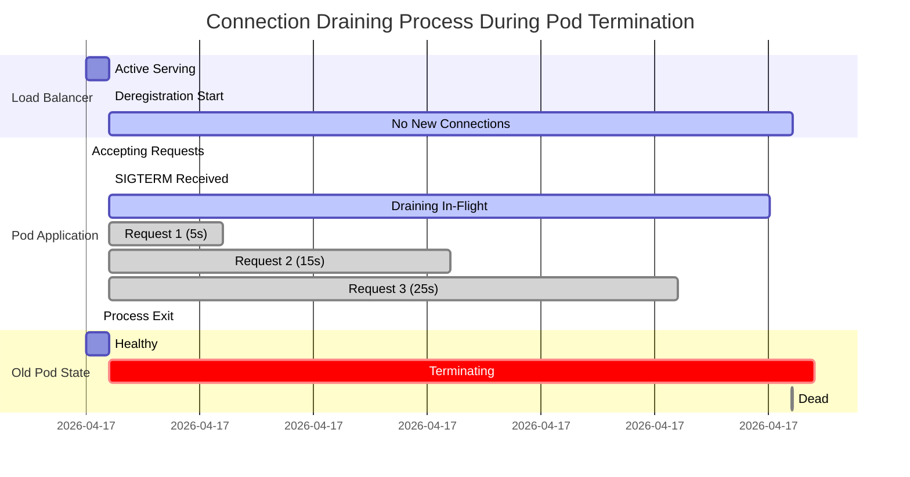

---

## 6. Database Expand-Migrate-Contract Phases

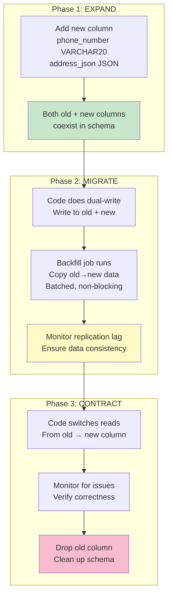

---

## 7. API Versioning During Deployment

```mermaid
graph LR
    subgraph "Backwards Compatibility"
        BC1["Old Client<br/>(v1 request format)"]
        BC2["API v2<br/>(accepts both v1 + v2<br/>request formats)"]
        BC3["Response<br/>(superset: all fields)"]
        BC1 --> BC2 --> BC3
    end
    
    subgraph "Dual API Endpoints"
        DA1["Old Endpoint<br/>/api/v1/users"]
        DA2["New Endpoint<br/>/api/v2/users"]
        DA3["Both for transition<br/>period"]
        DA1 --> DA3
        DA2 --> DA3
    end
    
    subgraph "Feature Flags"
        FF1["Flag: use_new_api<br/>Initially false"]
        FF2["Canary: 1% true"]
        FF3["Expand: 5% → 25% → 100%"]
        FF4["All clients on new API"]
        FF1 --> FF2 --> FF3 --> FF4
    end
    
    subgraph "Cleanup Phase"
        C1["Old endpoints still available<br/>for legacy clients"]
        C2["Deprecation period<br/>3-6 months notice"]
        C3["Remove old endpoints"]
        C1 --> C2 --> C3
    end
    
    BC3 -.->|After testing| DA1
    DA3 -.->|Next phase| FF1
    FF4 -.->|Months later| C1
```

---

## 8. Traffic Shifting with Istio Service Mesh

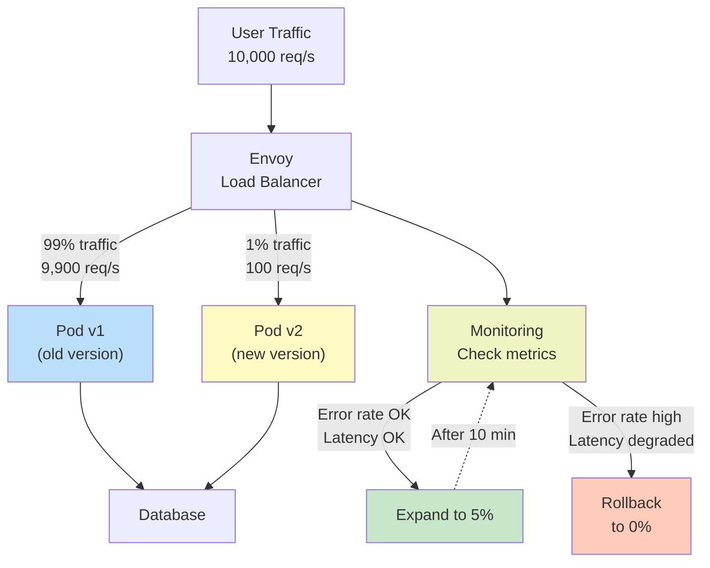

---

## 9. Blue-Green Deployment Switch

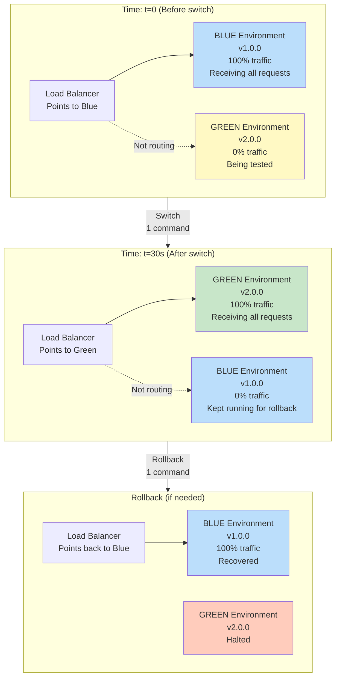

---

## 10. Deployment Monitoring Metrics

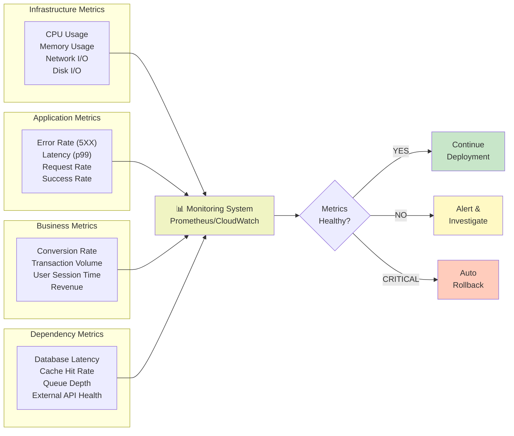

---

## 11. Health Check Probe Types and Lifecycle

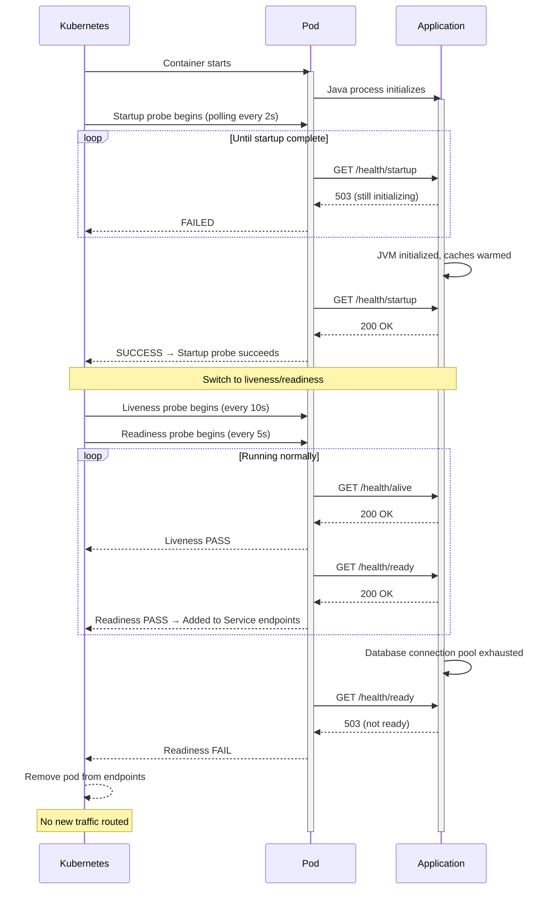

---

## 12. CI/CD Pipeline Integration

```mermaid
graph DT
    subgraph "1. Source"
        Git["Developer<br/>git push origin main"]
    end
    
    subgraph "2. Build"
        Build["Build Docker image<br/>Run unit tests<br/>Push to registry"]
    end
    
    subgraph "3. Test"
        Test["Run integration tests<br/>Security scanning<br/>Coverage > 80%"]
    end
    
    subgraph "4. Staging"
        Staging["Deploy to staging<br/>Run smoke tests<br/>Performance tests"]
    end
    
    subgraph "5. Approval"
        Approval["Manual approval<br/>Required before prod"]
    end
    
    subgraph "6. Production"
        Prod["Canary deployment<br/>1% → 5% → 25% → 50% → 100%<br/>Auto-rollback on metrics"]
    end
    
    subgraph "7. Monitor"
        Monitor["Extended monitoring<br/>30+ minutes<br/>Business metrics OK?"]
    end
    
    Git --> Build --> Test --> Staging --> Approval --> Prod --> Monitor
    
    Test -.->|Fail| Git
    Staging -.->|Fail| Git
    Prod -.->|Metrics bad| Git
    
    style Git fill:#e1f5ff
    style Build fill:#fff3e0
    style Test fill:#f3e5f5
    style Staging fill:#c8e6c9
    style Approval fill:#ffe0b2
    style Prod fill:#c5e1a5
    style Monitor fill:#b2dfdb
```

---

## 13. Service Dependency Chain Deployment

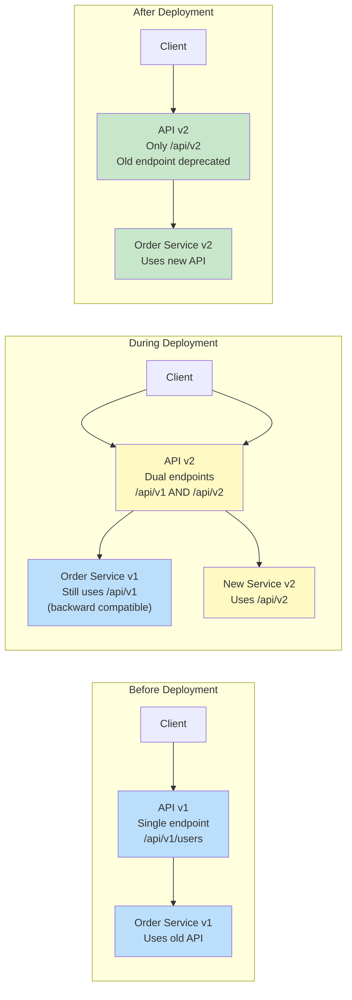

---

## 14. Cascading Failure: Security Group Trap

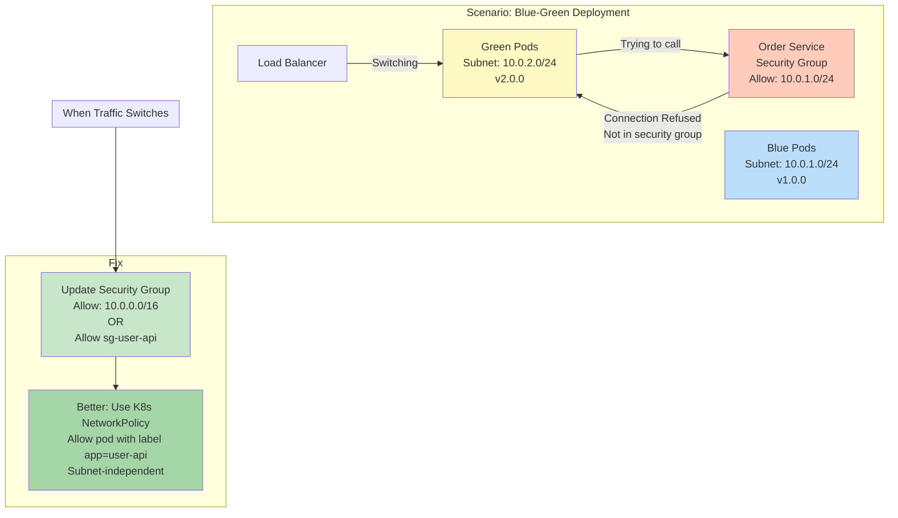

---

## 15. Memory Leak Detection During Canary

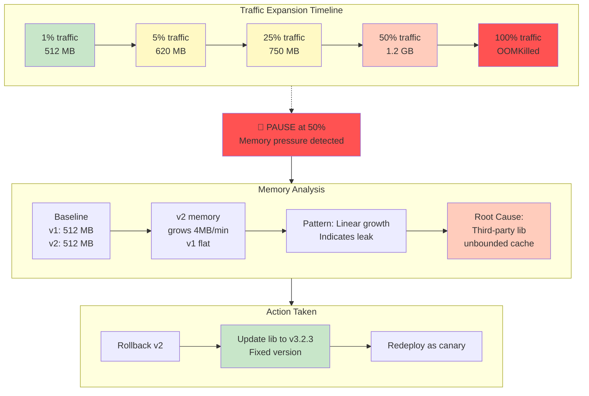

---

## 16. Backwards Compatibility Diagram (Two-Direction)

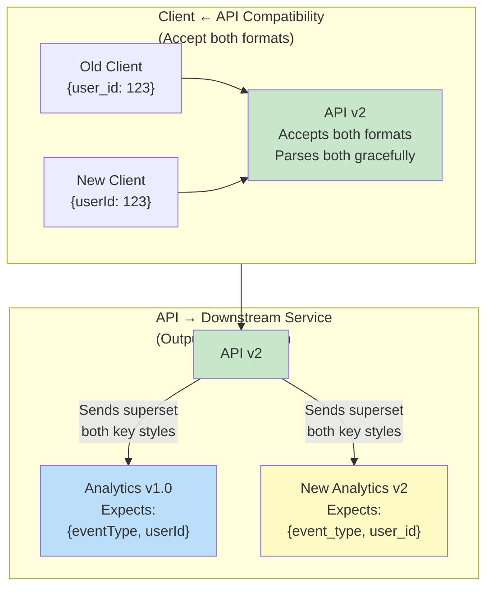

---

## 17. Kubernetes StatefulSet Upgrade with Health Validation

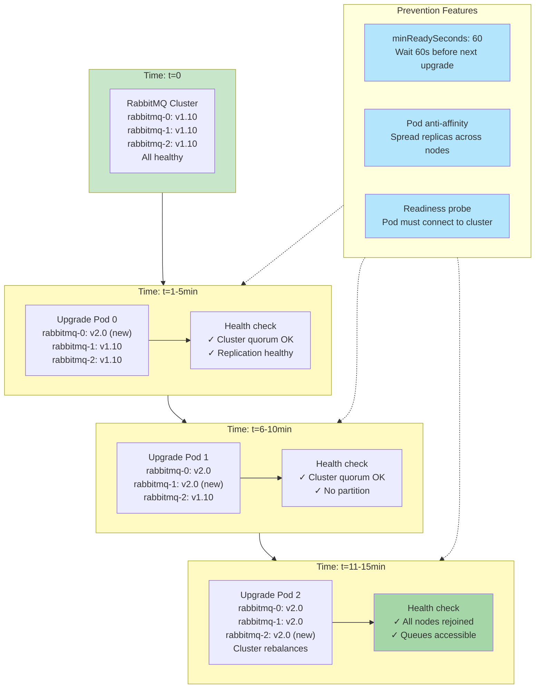

---

## 18. Automated Rollback Decision Tree

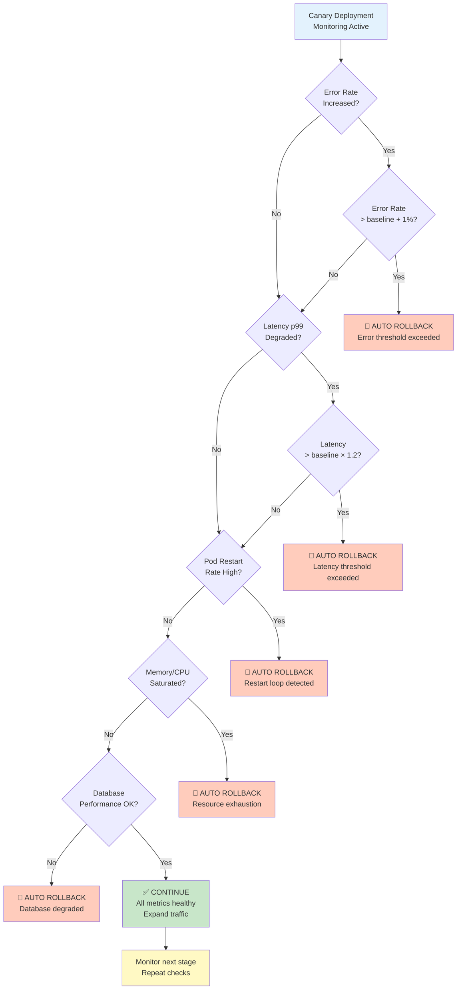

---

## 19. Graceful Shutdown Process

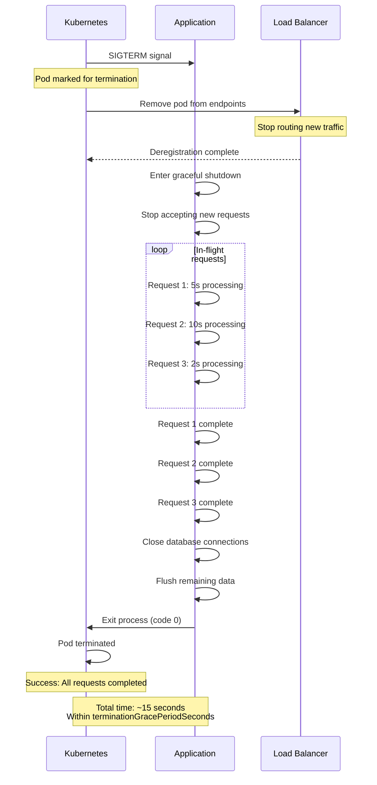

---

## 20. Full Deployment Lifecycle with All Phases

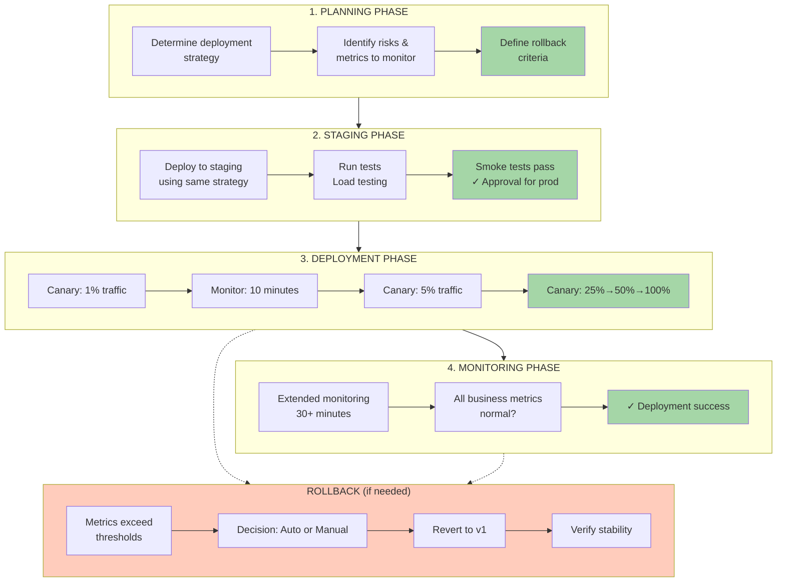

---

## 21. Payment Service Deployment Case Study

```mermaid
graph LR
    subgraph Weeks["1-2 Weeks: Development<br/>& Testing"]
        Dev["Develop new<br/>fraud algorithm"]
        UTest["Unit tests: 95%"]
        ITest["Integration tests<br/>Pass"]
        LTest["Load test<br/>100k req/s"]
        Dev --> UTest --> ITest --> LTest
    end
    
    subgraph Shadow["2 Weeks: Shadow<br/>Deployment"]
        S1["Deploy alongside<br/>production algorithm"]
        S2["Mirror 100% traffic"]
        S3["Compare decisions<br/>0.03% differ"]
        S4["Analyze differences<br/>✓ Safe"]
        S1 --> S2 --> S3 --> S4
    end
    
    subgraph Canary["4 Weeks: Canary<br/>Rollout"]
        C1["0.1% traffic<br/>Live detection"]
        C2["1% traffic"]
        C3["5% traffic"]
        C4["25% traffic"]
        C1 --> C2 --> C3 --> C4
    end
    
    subgraph Full["1 Week: Full<br/>Rollout"]
        F1["50% traffic"]
        F2["75% traffic"]
        F3["100% traffic"]
        F4["2 weeks extended<br/>monitoring"]
        F1 --> F2 --> F3 --> F4
    end
    
    Weeks --> Shadow --> Canary --> Full
    
    style LTest fill:#c8e6c9
    style S4 fill:#c8e6c9
    style C4 fill:#c8e6c9
    style F4 fill:#a5d6a7
```

---

## 22. Immutable Infrastructure Principle

```mermaid
graph TD
    subgraph Mutable["❌ MUTABLE (Dangerous)"]
        M1["ssh production-server"]
        M2["apt-get update && patch"]
        M3["Modify config locally"]
        M4["Restart service"]
        M5["Modified state unknown"]
        M1 --> M2 --> M3 --> M4 --> M5
    end
    
    subgraph Immutable["✅ IMMUTABLE (Safe)"]
        I1["Code change"]
        I2["Build new Docker image"]
        I3["Push to registry"]
        I4["Deploy new image"]
        I5["Old image available<br/>for rollback"]
        I1 --> I2 --> I3 --> I4 --> I5
    end
    
    subgraph Benefits["Benefits of Immutable"]
        B1["Reproducible: Same image locally<br/>and production"]
        B2["Rollback instant:<br/>Old image always available"]
        B3["Blue-green safe:<br/>Two immutable environments"]
        B4["Debugging easier:<br/>Known, unchanged state"]
    end
    
    style M5 fill:#ffccbc
    style I5 fill:#c8e6c9
    style B1 fill:#b3e5fc
    style B2 fill:#b3e5fc
    style B3 fill:#b3e5fc
    style B4 fill:#b3e5fc
```

---

## Summary

This comprehensive set of Mermaid diagrams covers:

- **Deployment Strategies**: Rolling, blue-green, canary, A/B, shadow
- **Kubernetes Concepts**: Probes, StatefulSets, pod lifecycle
- **Database Migrations**: Expand-migrate-contract pattern
- **Traffic Management**: Load balancing, service mesh
- **Monitoring & Rollback**: Automated decision trees
- **Real-world Scenarios**: Cascading failures, performance issues
- **Best Practices**: Immutable infrastructure, graceful shutdown
- **Case Studies**: Complete deployment lifecycle examples

Each diagram is self-contained and uses standard Mermaid syntax for easy integration into documentation, wikis, or training materials.

---

**Document Version**: 1.0  
**Total Diagrams**: 22 Mermaid visualizations  
**Format**: Markdown with embedded Mermaid code blocks  
**Use Cases**: Documentation, training, architecture review, incident analysis